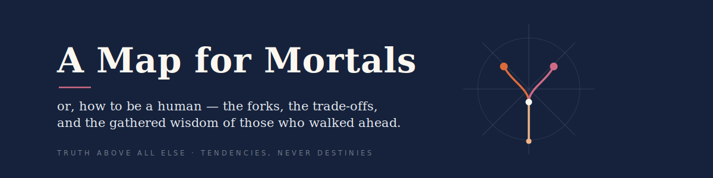
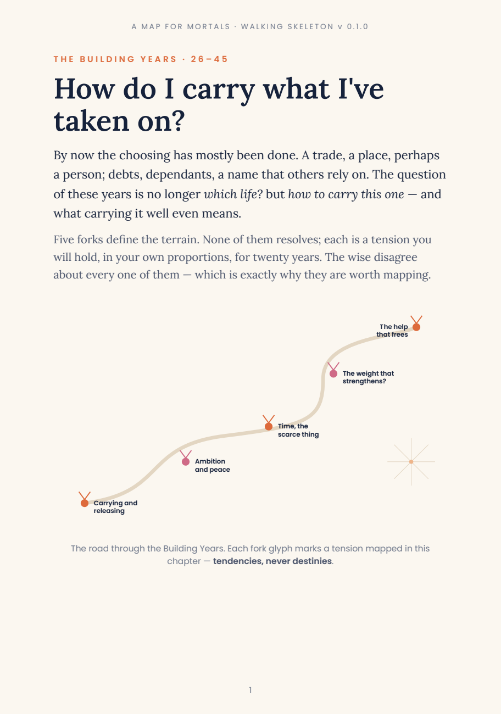
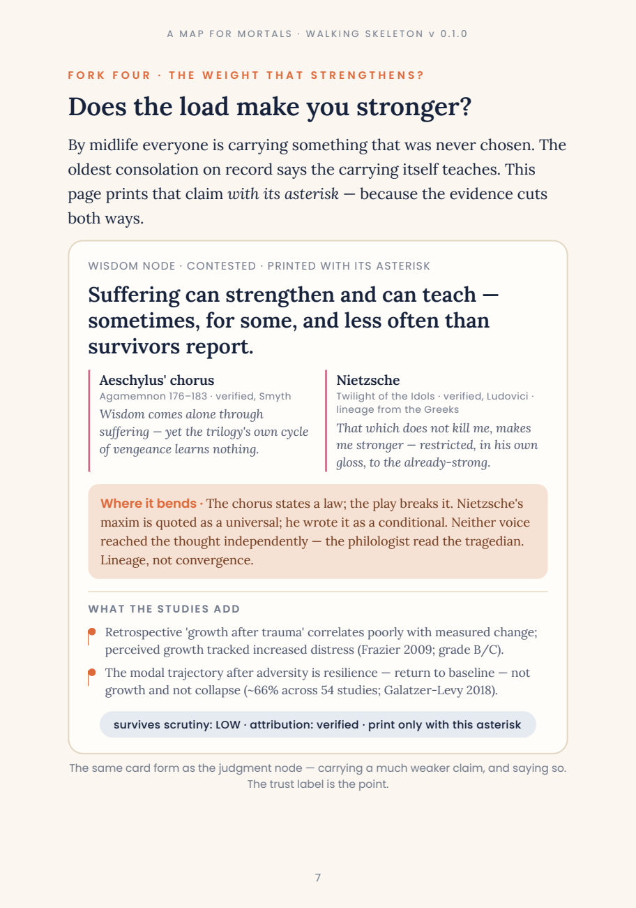

<p align="center">
  
</p>

**A Map for Mortals** charts human wisdom not as a list of answers but as **recurring forks** — the choices people face again and again, the tensions with no clean resolution, and the consequences that *tend*, on balance and over time, to follow. Where the wise disagree, the map shows the fork and the conditions under which each side applies. It does not resolve real tensions into platitudes; a genuine disagreement, shown plainly, teaches more than a false peace.

One versioned **wisdom graph** is the single source of truth. It renders into three things, in order: a **print book**, a free **interactive website**, and a **text-first life-sim game**.

<p align="center">
  
  &nbsp;&nbsp;
  
</p>
<p align="center"><sub><em>Two pages from the first rendered chapter. On the right: "suffering strengthens", printed <b>with its asterisk</b> —
the empirical evidence that contests it, and a trust label that says so.</em></sub></p>

## The fixed star

**Truth above all else.** Before ideology, aesthetics, comfort, sentiment, or marketability — and before whatever we would like to be true. Everything else in the method exists to protect that:

- **Tendencies, never destinies.** Most wisdom is conditional and probabilistic; a choice tilts the odds, it does not command the outcome.
- **Convergence is robustness, not truth.** When Epictetus, a rabbinic mishnah, and a hadith arrive at the same division of labour, that recurrence is *evidence to weigh* — and the map distinguishes ideas independently rediscovered from ideas that simply travelled.
- **Every quotation is guarded.** Nothing prints verbatim unless its wording has been verified against a primary edition and is public domain or licensed. The build refuses otherwise — mechanically. Famous misattributions are collected, debunked, and kept as exhibits.
- **Contradiction is data.** Dissent, minority readings, and failed replications are first-class objects in the graph, not problems to prune.

## How it works

```
deep-research corpus  ──►  wisdom graph (YAML in git)  ──►  the book
   15 reports,               units · claims · edges          page-specs → generator
   ~75 traditions            every judgment carries          → PDF, every page
                             provenance & confidence           visually inspected
```

Claude Code runs the pipeline autonomously — ingestion, primary-source verification, clustering, edge-building, curation, rendering — with an escalation queue for the genuinely contestable. High-stakes and contested interpretive calls get an adversarial second pass (an external or fresh-context adversary); routine calls get lead adjudication — the method is recorded per object, and applying that pass *at the publication gate* (not just at edge-building) is work still in progress (see `ops/adjudications/2026-07-07-external-review-round-3-response.md`). Units carry provenance and a verification tier; not every claim and edge yet records a separate judge-and-confidence trail — that transitional gap is tracked, not hidden. The audit trail lives in [`ops/`](ops/).

## Status

**Production build, mid v0.4 transition — under active re-adjudication.** The corpus holds **346 sourced units** across ~75 traditions (Greco-Roman, Confucian, Daoist, Buddhist, Hindu, Hebrew, Christian, Islamic, Zoroastrian, African, eight named Indigenous peoples, the moralists, the strategists, the poets — and the modern empirical literature, replication crisis included). The first chapter, *The Building Years*, renders through a graph-gated traced model: [`book/renders/building-years-v0.2.0.pdf`](book/renders/building-years-v0.2.0.pdf) — a **trace-system proof with content still under re-adjudication**, not a finished chapter. Three rounds of external adversarial review have landed; the gate ledger and its honest current statuses live in [`STATE.md`](STATE.md).

## Layout

| | |
|---|---|
| [`graph/`](graph/) | **the store** — units, claims, edges; schema in `A-Map-for-Mortals-METHODOLOGY.md` |
| [`book/`](book/) | generator, page-specs, renders — the book is *generated from the graph*, never hand-authored |
| [`corpus/`](corpus/) | deep-research reports (as received) + the coverage index |
| [`ops/`](ops/) | escalations, decisions, adjudication records — the audit trail |
| [`docs/`](docs/) | founding principles (canonical) and background |
| [`tools/`](tools/) | validators and pipeline scripts |
| [`prototype/`](prototype/) | archived v0.0.1 hand-authored slice (locked) |

## Licence

Three regimes, deliberately (see [`LICENSE.md`](LICENSE.md)): **code is MIT** · **graph & book are all rights reserved *for now*** — the book is generated from the graph, so opening the graph is opening the book; that irrevocable step waits until edition 1, with a declared presumption toward opening · **corpus reports are unlicensed, published for audit only**. Everything is publicly readable — auditability is the point.

---

<p align="center"><em>Convergence is robustness, not truth. Recurrence is resonance, not proof.</em></p>
