# A Map of the Forks in the Road
### A book of life-wisdom decision trees, to grow up alongside

*Volume I — a living first draft to refine, illustrate, and pass down.*

---

I wish someone had drawn me these when I was small. Not lectures — **maps**. Pictures of the forks you'll meet, the two ways each one tends to go, and the small handful of things that the people who thought hardest about living — the Stoics, Nietzsche, Aristotle, and a few wise modern voices — figured out along the way.

None of this is gospel. Most of it has no stronger backing than honest experience and a few real statistics, and where there are numbers I've said so. You'll write your own map in the end. But here's a head start.

**How to read a tree**
- A **rounded box** is the situation you're standing in.
- A **diamond** is a *choice* — your fork in the road.
- **Green** is the path that tends to turn out well; **amber** is the harder road; **red** is the one with a rare but serious downside.
- The **purple box** at the bottom is the lesson, and who it comes from.

The colours show *tendencies*, not certainties. Life is, as the Sunscreen song put it, half chance. But you steer the other half.

---

## Age 4–5 — The first foundations

### 1.1 · When a big feeling arrives
*Emotional self-control — the Stoics*

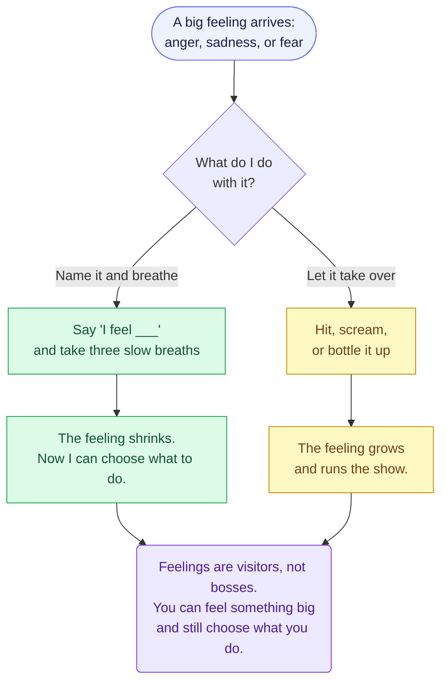
```mermaid
flowchart TD
  A(["A big feeling arrives:<br/>anger, sadness, or fear"]) --> B{"What do I do<br/>with it?"}
  B -->|"Name it and breathe"| C["Say 'I feel ___'<br/>and take three slow breaths"]
  B -->|"Let it take over"| D["Hit, scream,<br/>or bottle it up"]
  C --> E["The feeling shrinks.<br/>Now I can choose what to do."]
  D --> F["The feeling grows<br/>and runs the show."]
  E --> W("Feelings are visitors, not bosses.<br/>You can feel something big<br/>and still choose what you do.")
  F --> W
  classDef start fill:#eef2ff,stroke:#6366f1,color:#1e1b4b;
  classDef good fill:#dcfce7,stroke:#16a34a,color:#14532d;
  classDef warn fill:#fef9c3,stroke:#ca8a04,color:#713f12;
  classDef wisdom fill:#ede9fe,stroke:#7c3aed,color:#4c1d95;
  class A start;
  class C,E good;
  class D,F warn;
  class W wisdom;
```

### 1.2 · When you break something or make a mistake
*Honesty — the cost of a lie vs. the cost of the truth*

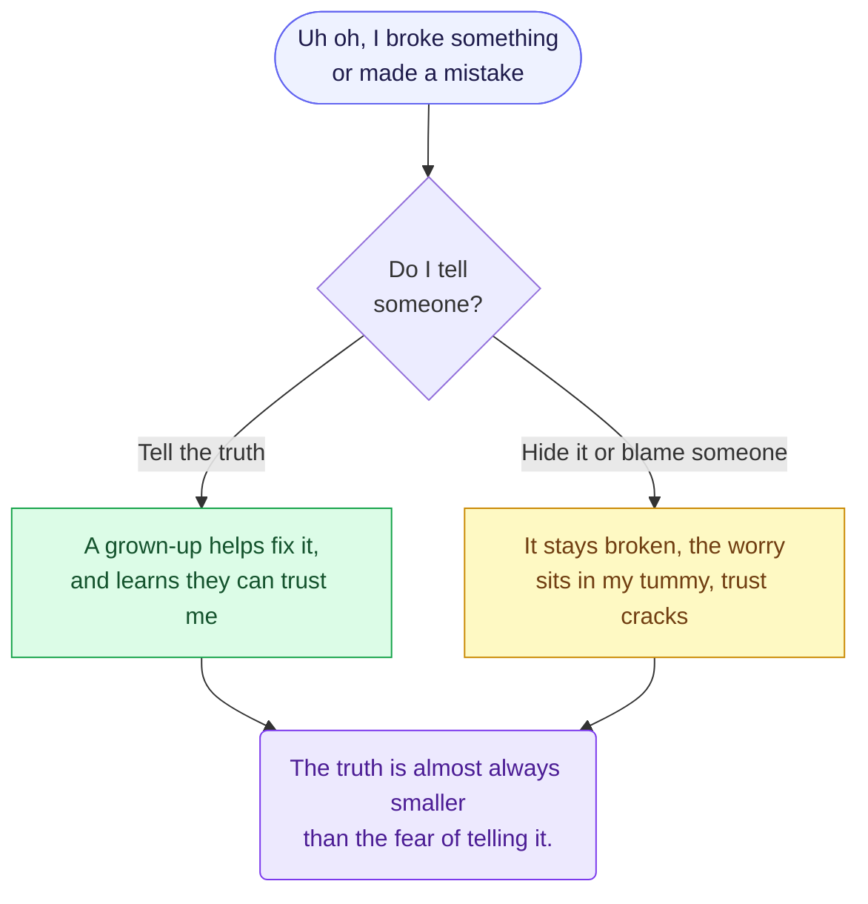
```mermaid
flowchart TD
  A(["Uh oh, I broke something<br/>or made a mistake"]) --> B{"Do I tell<br/>someone?"}
  B -->|"Tell the truth"| C["A grown-up helps fix it,<br/>and learns they can trust me"]
  B -->|"Hide it or blame someone"| D["It stays broken, the worry<br/>sits in my tummy, trust cracks"]
  C --> W("The truth is almost always smaller<br/>than the fear of telling it.")
  D --> W
  classDef start fill:#eef2ff,stroke:#6366f1,color:#1e1b4b;
  classDef good fill:#dcfce7,stroke:#16a34a,color:#14532d;
  classDef warn fill:#fef9c3,stroke:#ca8a04,color:#713f12;
  classDef wisdom fill:#ede9fe,stroke:#7c3aed,color:#4c1d95;
  class A start;
  class C good;
  class D warn;
  class W wisdom;
```

### 1.3 · When something is hard
*The growth mindset — Carol Dweck*

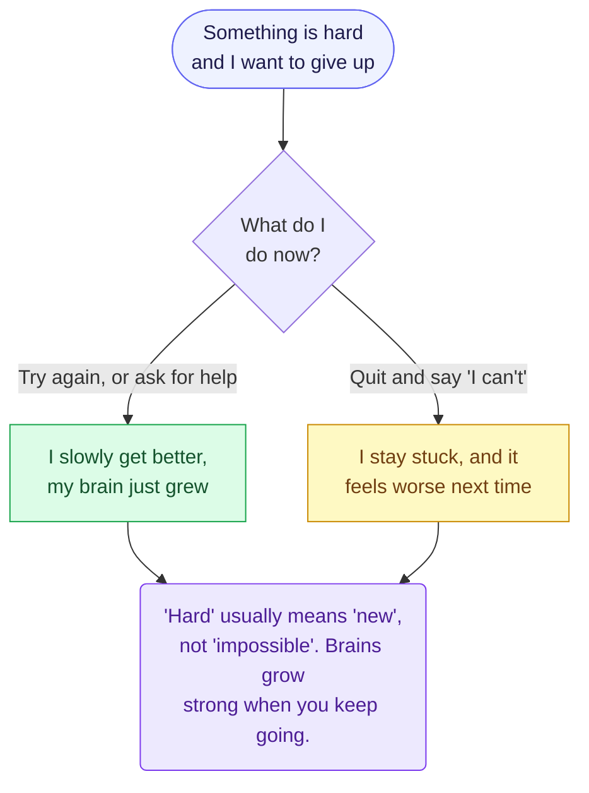
```mermaid
flowchart TD
  A(["Something is hard<br/>and I want to give up"]) --> B{"What do I<br/>do now?"}
  B -->|"Try again, or ask for help"| C["I slowly get better,<br/>my brain just grew"]
  B -->|"Quit and say 'I can't'"| D["I stay stuck, and it<br/>feels worse next time"]
  C --> W("'Hard' usually means 'new',<br/>not 'impossible'. Brains grow<br/>strong when you keep going.")
  D --> W
  classDef start fill:#eef2ff,stroke:#6366f1,color:#1e1b4b;
  classDef good fill:#dcfce7,stroke:#16a34a,color:#14532d;
  classDef warn fill:#fef9c3,stroke:#ca8a04,color:#713f12;
  classDef wisdom fill:#ede9fe,stroke:#7c3aed,color:#4c1d95;
  class A start;
  class C good;
  class D warn;
  class W wisdom;
```

### 1.4 · When you want what someone else has
*Kindness and fairness — the Golden Rule*

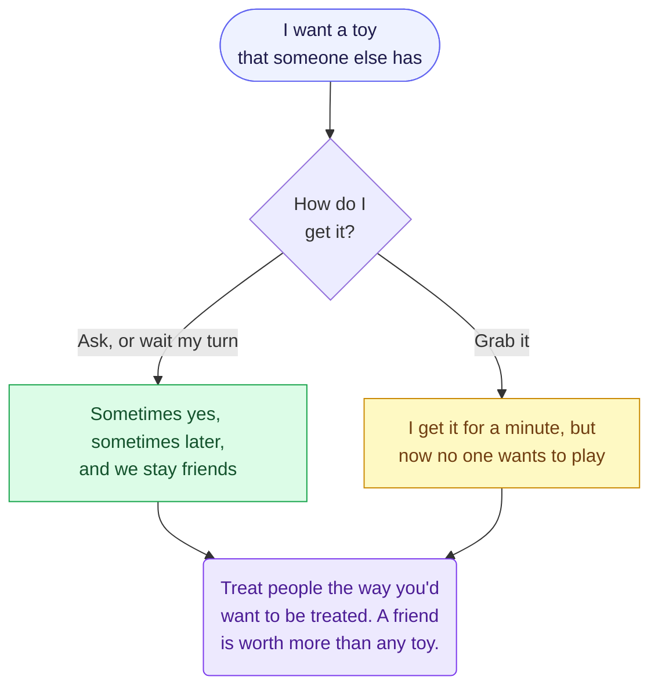
```mermaid
flowchart TD
  A(["I want a toy<br/>that someone else has"]) --> B{"How do I<br/>get it?"}
  B -->|"Ask, or wait my turn"| C["Sometimes yes, sometimes later,<br/>and we stay friends"]
  B -->|"Grab it"| D["I get it for a minute, but<br/>now no one wants to play"]
  C --> W("Treat people the way you'd<br/>want to be treated. A friend<br/>is worth more than any toy.")
  D --> W
  classDef start fill:#eef2ff,stroke:#6366f1,color:#1e1b4b;
  classDef good fill:#dcfce7,stroke:#16a34a,color:#14532d;
  classDef warn fill:#fef9c3,stroke:#ca8a04,color:#713f12;
  classDef wisdom fill:#ede9fe,stroke:#7c3aed,color:#4c1d95;
  class A start;
  class C good;
  class D warn;
  class W wisdom;
```

---

## Age 6–8 — Starting school

### 2.1 · "I'm not good at this"
*Effort over talent — the power of the word "yet"*

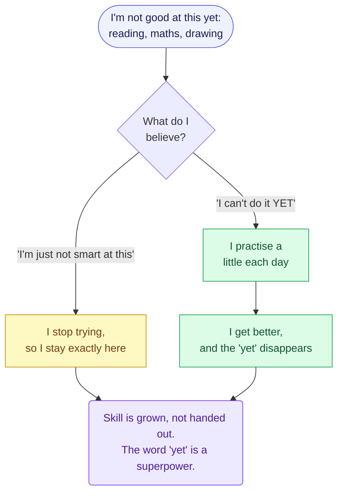
```mermaid
flowchart TD
  A(["I'm not good at this yet:<br/>reading, maths, drawing"]) --> B{"What do I<br/>believe?"}
  B -->|"'I'm just not smart at this'"| C["I stop trying,<br/>so I stay exactly here"]
  B -->|"'I can't do it YET'"| D["I practise a<br/>little each day"]
  D --> E["I get better,<br/>and the 'yet' disappears"]
  C --> W("Skill is grown, not handed out.<br/>The word 'yet' is a superpower.")
  E --> W
  classDef start fill:#eef2ff,stroke:#6366f1,color:#1e1b4b;
  classDef good fill:#dcfce7,stroke:#16a34a,color:#14532d;
  classDef warn fill:#fef9c3,stroke:#ca8a04,color:#713f12;
  classDef wisdom fill:#ede9fe,stroke:#7c3aed,color:#4c1d95;
  class A start;
  class D,E good;
  class C warn;
  class W wisdom;
```

### 2.2 · Making a friend
*Real friendship — Aristotle*

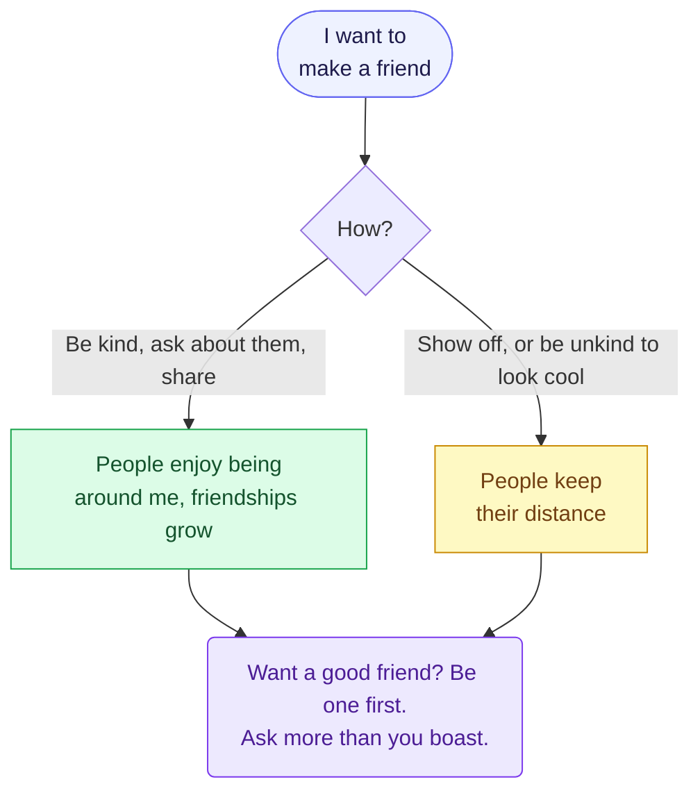
```mermaid
flowchart TD
  A(["I want to<br/>make a friend"]) --> B{"How?"}
  B -->|"Be kind, ask about them, share"| C["People enjoy being<br/>around me, friendships grow"]
  B -->|"Show off, or be unkind to look cool"| D["People keep<br/>their distance"]
  C --> W("Want a good friend? Be one first.<br/>Ask more than you boast.")
  D --> W
  classDef start fill:#eef2ff,stroke:#6366f1,color:#1e1b4b;
  classDef good fill:#dcfce7,stroke:#16a34a,color:#14532d;
  classDef warn fill:#fef9c3,stroke:#ca8a04,color:#713f12;
  classDef wisdom fill:#ede9fe,stroke:#7c3aed,color:#4c1d95;
  class A start;
  class C good;
  class D warn;
  class W wisdom;
```

### 2.3 · "I tried and I failed"
*Failure is information, not identity*

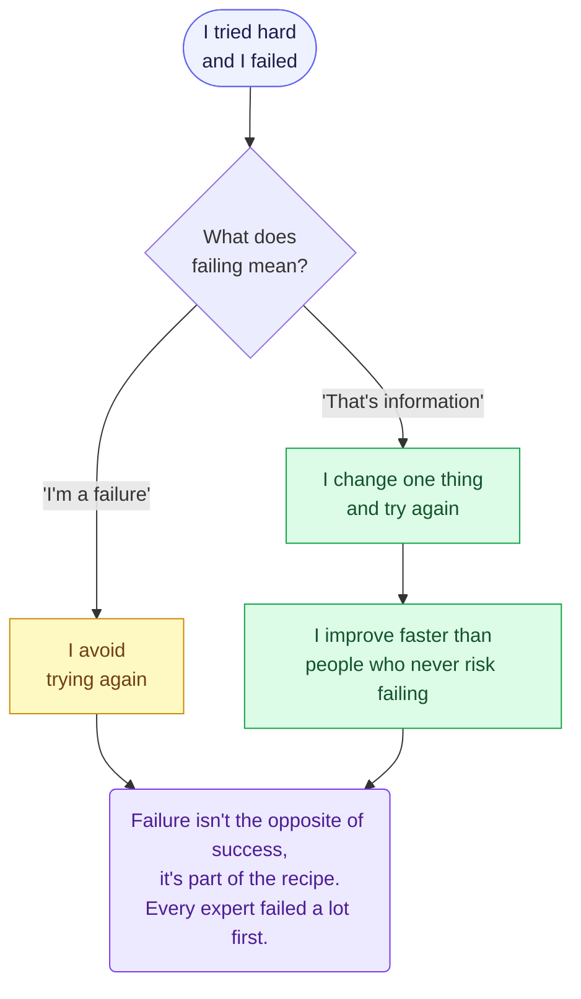
```mermaid
flowchart TD
  A(["I tried hard<br/>and I failed"]) --> B{"What does<br/>failing mean?"}
  B -->|"'I'm a failure'"| C["I avoid<br/>trying again"]
  B -->|"'That's information'"| D["I change one thing<br/>and try again"]
  D --> E["I improve faster than<br/>people who never risk failing"]
  C --> W("Failure isn't the opposite of success,<br/>it's part of the recipe.<br/>Every expert failed a lot first.")
  E --> W
  classDef start fill:#eef2ff,stroke:#6366f1,color:#1e1b4b;
  classDef good fill:#dcfce7,stroke:#16a34a,color:#14532d;
  classDef warn fill:#fef9c3,stroke:#ca8a04,color:#713f12;
  classDef wisdom fill:#ede9fe,stroke:#7c3aed,color:#4c1d95;
  class A start;
  class D,E good;
  class C warn;
  class W wisdom;
```

### 2.4 · The hard truth
*Integrity — your word is who you are (the Stoics)*

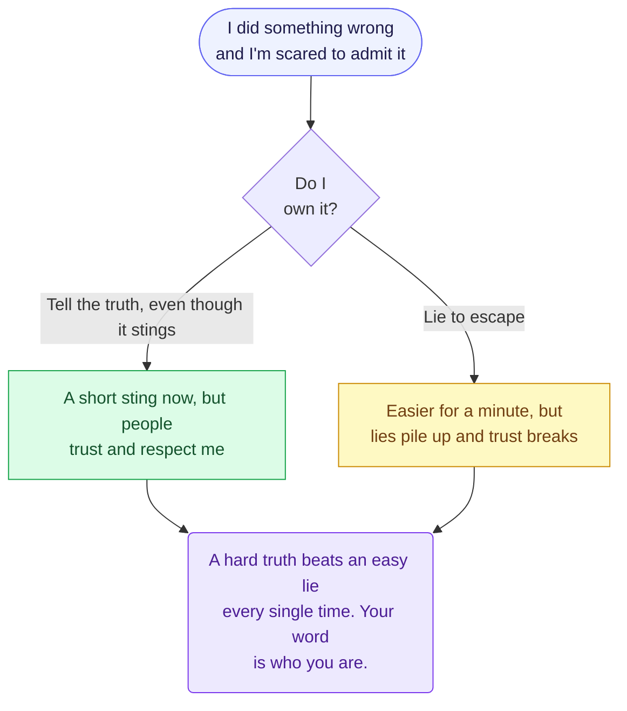
```mermaid
flowchart TD
  A(["I did something wrong<br/>and I'm scared to admit it"]) --> B{"Do I<br/>own it?"}
  B -->|"Tell the truth, even though it stings"| C["A short sting now, but people<br/>trust and respect me"]
  B -->|"Lie to escape"| D["Easier for a minute, but<br/>lies pile up and trust breaks"]
  C --> W("A hard truth beats an easy lie<br/>every single time. Your word<br/>is who you are.")
  D --> W
  classDef start fill:#eef2ff,stroke:#6366f1,color:#1e1b4b;
  classDef good fill:#dcfce7,stroke:#16a34a,color:#14532d;
  classDef warn fill:#fef9c3,stroke:#ca8a04,color:#713f12;
  classDef wisdom fill:#ede9fe,stroke:#7c3aed,color:#4c1d95;
  class A start;
  class C good;
  class D warn;
  class W wisdom;
```

---

## Age 9–11 — The pre-teen years

### 3.1 · Money in your pocket
*Delayed gratification — the seed of compounding*

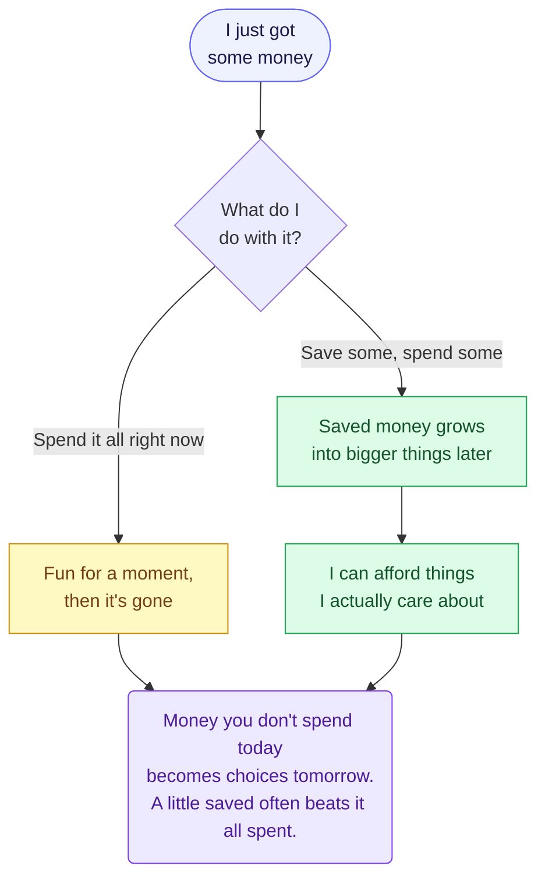
```mermaid
flowchart TD
  A(["I just got<br/>some money"]) --> B{"What do I<br/>do with it?"}
  B -->|"Spend it all right now"| C["Fun for a moment,<br/>then it's gone"]
  B -->|"Save some, spend some"| D["Saved money grows<br/>into bigger things later"]
  D --> E["I can afford things<br/>I actually care about"]
  C --> W("Money you don't spend today<br/>becomes choices tomorrow.<br/>A little saved often beats it all spent.")
  E --> W
  classDef start fill:#eef2ff,stroke:#6366f1,color:#1e1b4b;
  classDef good fill:#dcfce7,stroke:#16a34a,color:#14532d;
  classDef warn fill:#fef9c3,stroke:#ca8a04,color:#713f12;
  classDef wisdom fill:#ede9fe,stroke:#7c3aed,color:#4c1d95;
  class A start;
  class D,E good;
  class C warn;
  class W wisdom;
```

### 3.2 · What to do with free time
*Be a maker, not just a watcher*

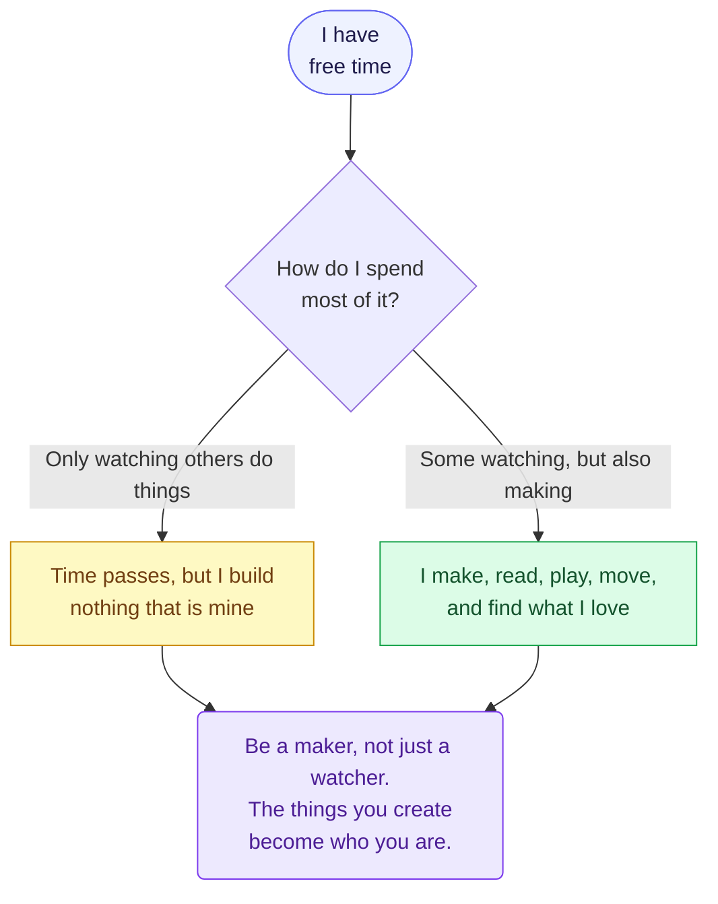
```mermaid
flowchart TD
  A(["I have<br/>free time"]) --> B{"How do I spend<br/>most of it?"}
  B -->|"Only watching others do things"| C["Time passes, but I build<br/>nothing that is mine"]
  B -->|"Some watching, but also making"| D["I make, read, play, move,<br/>and find what I love"]
  C --> W("Be a maker, not just a watcher.<br/>The things you create<br/>become who you are.")
  D --> W
  classDef start fill:#eef2ff,stroke:#6366f1,color:#1e1b4b;
  classDef good fill:#dcfce7,stroke:#16a34a,color:#14532d;
  classDef warn fill:#fef9c3,stroke:#ca8a04,color:#713f12;
  classDef wisdom fill:#ede9fe,stroke:#7c3aed,color:#4c1d95;
  class A start;
  class D good;
  class C warn;
  class W wisdom;
```

### 3.3 · When friends do wrong
*Your own compass — Epictetus*

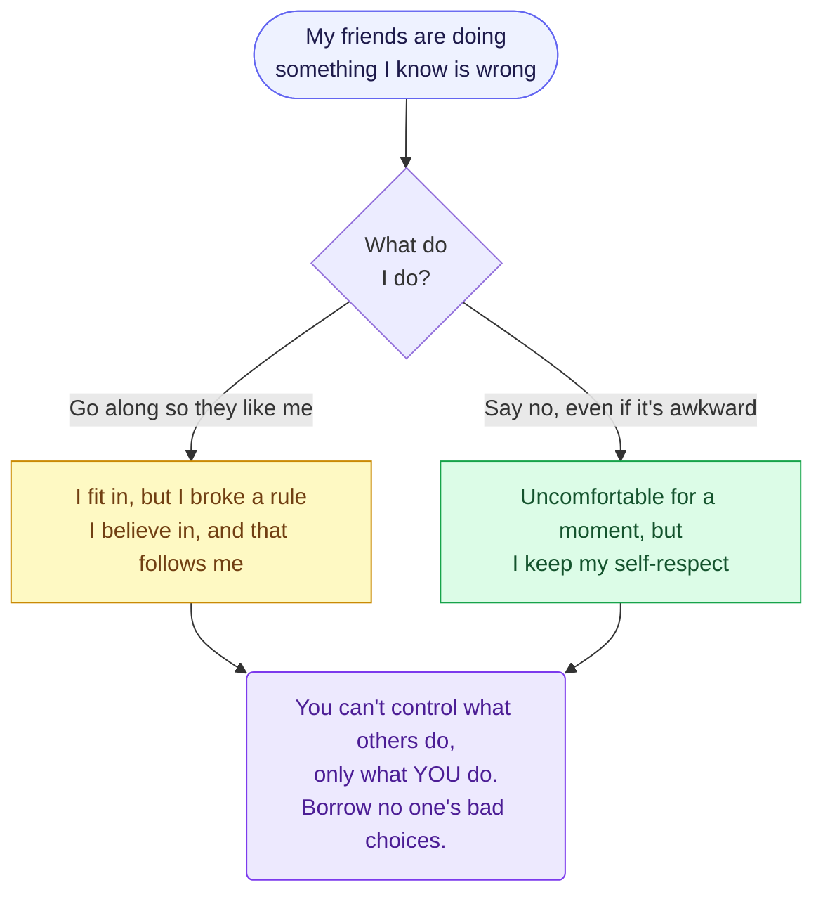
```mermaid
flowchart TD
  A(["My friends are doing<br/>something I know is wrong"]) --> B{"What do<br/>I do?"}
  B -->|"Go along so they like me"| C["I fit in, but I broke a rule<br/>I believe in, and that follows me"]
  B -->|"Say no, even if it's awkward"| D["Uncomfortable for a moment, but<br/>I keep my self-respect"]
  C --> W("You can't control what others do,<br/>only what YOU do.<br/>Borrow no one's bad choices.")
  D --> W
  classDef start fill:#eef2ff,stroke:#6366f1,color:#1e1b4b;
  classDef good fill:#dcfce7,stroke:#16a34a,color:#14532d;
  classDef warn fill:#fef9c3,stroke:#ca8a04,color:#713f12;
  classDef wisdom fill:#ede9fe,stroke:#7c3aed,color:#4c1d95;
  class A start;
  class D good;
  class C warn;
  class W wisdom;
```

### 3.4 · "I'm bored"
*Boredom is the doorway to imagination*

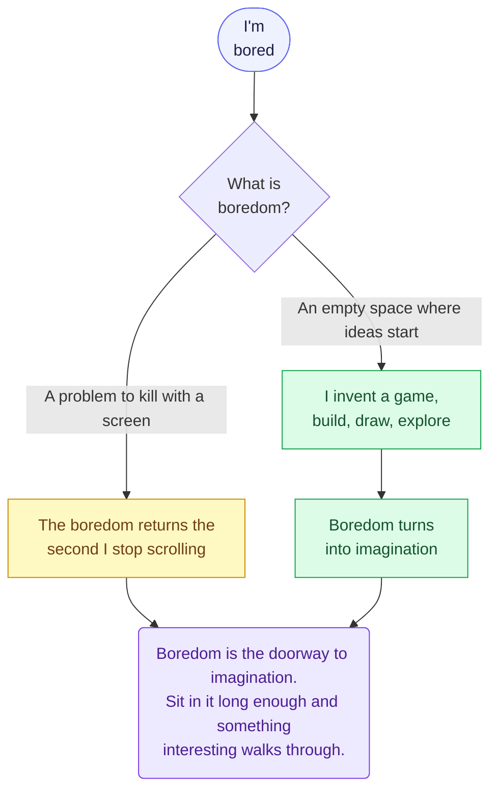
```mermaid
flowchart TD
  A(["I'm<br/>bored"]) --> B{"What is<br/>boredom?"}
  B -->|"A problem to kill with a screen"| C["The boredom returns the<br/>second I stop scrolling"]
  B -->|"An empty space where ideas start"| D["I invent a game,<br/>build, draw, explore"]
  D --> E["Boredom turns<br/>into imagination"]
  C --> W("Boredom is the doorway to imagination.<br/>Sit in it long enough and something<br/>interesting walks through.")
  E --> W
  classDef start fill:#eef2ff,stroke:#6366f1,color:#1e1b4b;
  classDef good fill:#dcfce7,stroke:#16a34a,color:#14532d;
  classDef warn fill:#fef9c3,stroke:#ca8a04,color:#713f12;
  classDef wisdom fill:#ede9fe,stroke:#7c3aed,color:#4c1d95;
  class A start;
  class D,E good;
  class C warn;
  class W wisdom;
```

---

## Age 12–14 — The early teens

### 4.1 · Everyone online looks better than me
*Comparison is the thief of joy — often credited to Theodore Roosevelt*

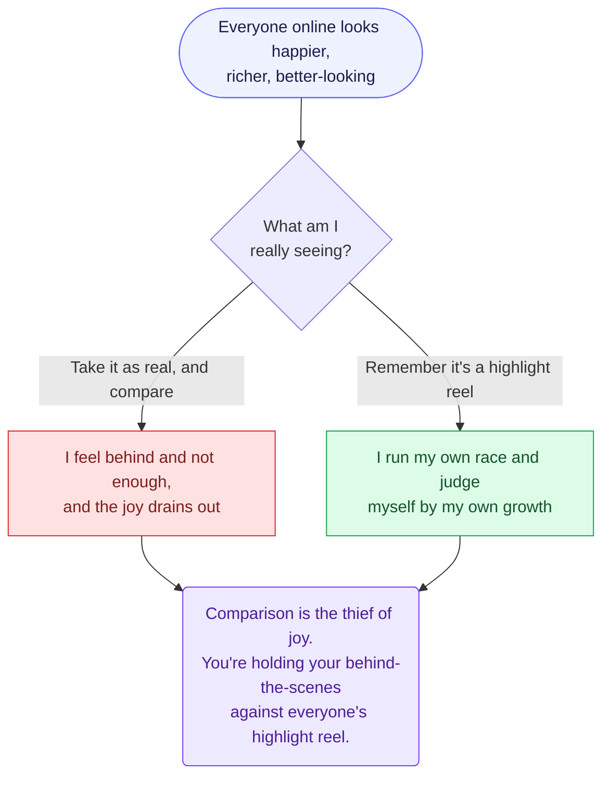
```mermaid
flowchart TD
  A(["Everyone online looks happier,<br/>richer, better-looking"]) --> B{"What am I<br/>really seeing?"}
  B -->|"Take it as real, and compare"| C["I feel behind and not enough,<br/>and the joy drains out"]
  B -->|"Remember it's a highlight reel"| D["I run my own race and judge<br/>myself by my own growth"]
  C --> W("Comparison is the thief of joy.<br/>You're holding your behind-the-scenes<br/>against everyone's highlight reel.")
  D --> W
  classDef start fill:#eef2ff,stroke:#6366f1,color:#1e1b4b;
  classDef good fill:#dcfce7,stroke:#16a34a,color:#14532d;
  classDef warn fill:#fef9c3,stroke:#ca8a04,color:#713f12;
  classDef bad fill:#fee2e2,stroke:#dc2626,color:#7f1d1d;
  classDef wisdom fill:#ede9fe,stroke:#7c3aed,color:#4c1d95;
  class A start;
  class D good;
  class C bad;
  class W wisdom;
```

### 4.2 · How to actually get good at something
*Deliberate practice — Anders Ericsson (and a caveat)*

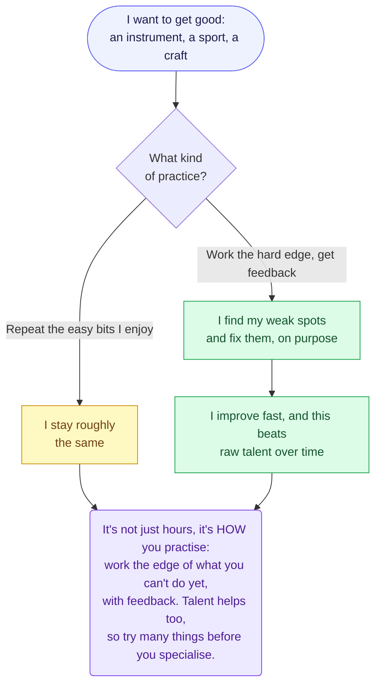
```mermaid
flowchart TD
  A(["I want to get good:<br/>an instrument, a sport, a craft"]) --> B{"What kind<br/>of practice?"}
  B -->|"Repeat the easy bits I enjoy"| C["I stay roughly<br/>the same"]
  B -->|"Work the hard edge, get feedback"| D["I find my weak spots<br/>and fix them, on purpose"]
  D --> E["I improve fast, and this beats<br/>raw talent over time"]
  C --> W("It's not just hours, it's HOW you practise:<br/>work the edge of what you can't do yet,<br/>with feedback. Talent helps too,<br/>so try many things before you specialise.")
  E --> W
  classDef start fill:#eef2ff,stroke:#6366f1,color:#1e1b4b;
  classDef good fill:#dcfce7,stroke:#16a34a,color:#14532d;
  classDef warn fill:#fef9c3,stroke:#ca8a04,color:#713f12;
  classDef wisdom fill:#ede9fe,stroke:#7c3aed,color:#4c1d95;
  class A start;
  class D,E good;
  class C warn;
  class W wisdom;
```

### 4.3 · "I want it the moment I see it"
*Wants vs. needs, and the magic of starting young*

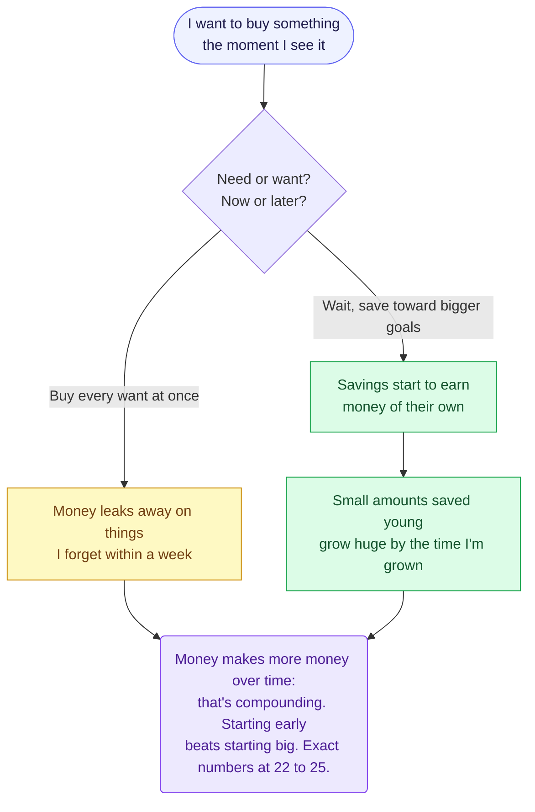
```mermaid
flowchart TD
  A(["I want to buy something<br/>the moment I see it"]) --> B{"Need or want?<br/>Now or later?"}
  B -->|"Buy every want at once"| C["Money leaks away on things<br/>I forget within a week"]
  B -->|"Wait, save toward bigger goals"| D["Savings start to earn<br/>money of their own"]
  D --> E["Small amounts saved young<br/>grow huge by the time I'm grown"]
  C --> W("Money makes more money over time:<br/>that's compounding. Starting early<br/>beats starting big. Exact numbers at 22 to 25.")
  E --> W
  classDef start fill:#eef2ff,stroke:#6366f1,color:#1e1b4b;
  classDef good fill:#dcfce7,stroke:#16a34a,color:#14532d;
  classDef warn fill:#fef9c3,stroke:#ca8a04,color:#713f12;
  classDef wisdom fill:#ede9fe,stroke:#7c3aed,color:#4c1d95;
  class A start;
  class D,E good;
  class C warn;
  class W wisdom;
```

### 4.4 · The dare, and your reputation
*Think in odds — small reward, huge possible cost*

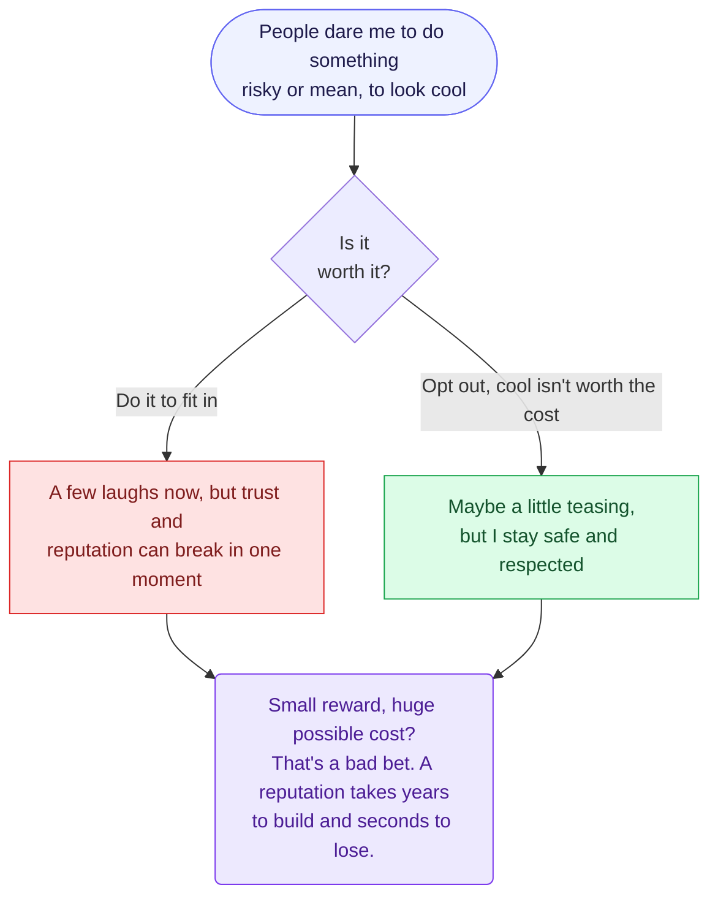
```mermaid
flowchart TD
  A(["People dare me to do something<br/>risky or mean, to look cool"]) --> B{"Is it<br/>worth it?"}
  B -->|"Do it to fit in"| C["A few laughs now, but trust and<br/>reputation can break in one moment"]
  B -->|"Opt out, cool isn't worth the cost"| D["Maybe a little teasing,<br/>but I stay safe and respected"]
  C --> W("Small reward, huge possible cost?<br/>That's a bad bet. A reputation takes years<br/>to build and seconds to lose.")
  D --> W
  classDef start fill:#eef2ff,stroke:#6366f1,color:#1e1b4b;
  classDef good fill:#dcfce7,stroke:#16a34a,color:#14532d;
  classDef warn fill:#fef9c3,stroke:#ca8a04,color:#713f12;
  classDef bad fill:#fee2e2,stroke:#dc2626,color:#7f1d1d;
  classDef wisdom fill:#ede9fe,stroke:#7c3aed,color:#4c1d95;
  class A start;
  class D good;
  class C bad;
  class W wisdom;
```

---

## Age 15–17 — The middle teens

### 5.1 · Strong feelings for someone
*Hearts, handled with care — the spirit of "Sunscreen"*

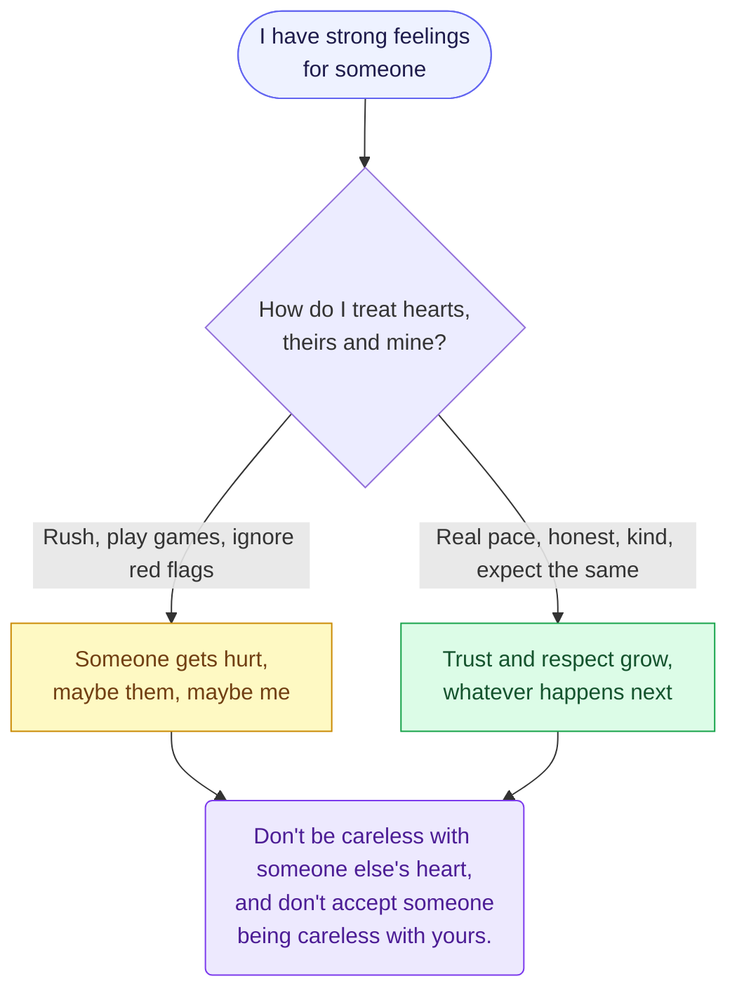
```mermaid
flowchart TD
  A(["I have strong feelings<br/>for someone"]) --> B{"How do I treat hearts,<br/>theirs and mine?"}
  B -->|"Rush, play games, ignore red flags"| C["Someone gets hurt,<br/>maybe them, maybe me"]
  B -->|"Real pace, honest, kind, expect the same"| D["Trust and respect grow,<br/>whatever happens next"]
  C --> W("Don't be careless with someone else's heart,<br/>and don't accept someone<br/>being careless with yours.")
  D --> W
  classDef start fill:#eef2ff,stroke:#6366f1,color:#1e1b4b;
  classDef good fill:#dcfce7,stroke:#16a34a,color:#14532d;
  classDef warn fill:#fef9c3,stroke:#ca8a04,color:#713f12;
  classDef wisdom fill:#ede9fe,stroke:#7c3aed,color:#4c1d95;
  class A start;
  class D good;
  class C warn;
  class W wisdom;
```

### 5.2 · The asymmetric bet
*Small upside, catastrophic downside — premeditatio malorum (the Stoics)*

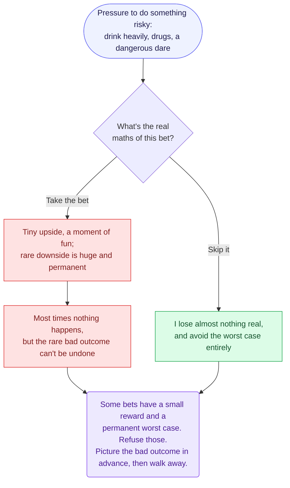
```mermaid
flowchart TD
  A(["Pressure to do something risky:<br/>drink heavily, drugs, a dangerous dare"]) --> B{"What's the real<br/>maths of this bet?"}
  B -->|"Take the bet"| C["Tiny upside, a moment of fun;<br/>rare downside is huge and permanent"]
  B -->|"Skip it"| D["I lose almost nothing real,<br/>and avoid the worst case entirely"]
  C --> E["Most times nothing happens,<br/>but the rare bad outcome can't be undone"]
  E --> W("Some bets have a small reward and a<br/>permanent worst case. Refuse those.<br/>Picture the bad outcome in advance, then walk away.")
  D --> W
  classDef start fill:#eef2ff,stroke:#6366f1,color:#1e1b4b;
  classDef good fill:#dcfce7,stroke:#16a34a,color:#14532d;
  classDef warn fill:#fef9c3,stroke:#ca8a04,color:#713f12;
  classDef bad fill:#fee2e2,stroke:#dc2626,color:#7f1d1d;
  classDef wisdom fill:#ede9fe,stroke:#7c3aed,color:#4c1d95;
  class A start;
  class D good;
  class C,E bad;
  class W wisdom;
```

### 5.3 · "It's just one small choice today"
*Habits compound into who you become*

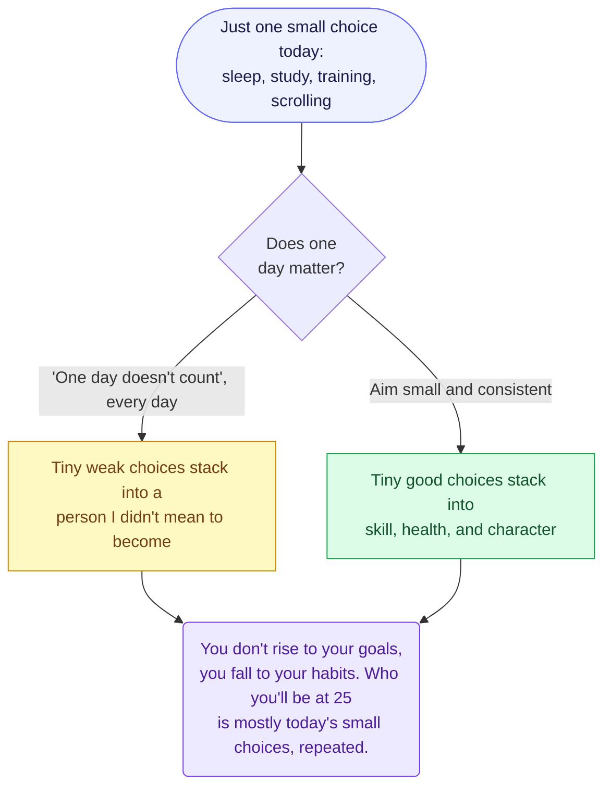
```mermaid
flowchart TD
  A(["Just one small choice today:<br/>sleep, study, training, scrolling"]) --> B{"Does one<br/>day matter?"}
  B -->|"'One day doesn't count', every day"| C["Tiny weak choices stack into a<br/>person I didn't mean to become"]
  B -->|"Aim small and consistent"| D["Tiny good choices stack into<br/>skill, health, and character"]
  C --> W("You don't rise to your goals,<br/>you fall to your habits. Who you'll be at 25<br/>is mostly today's small choices, repeated.")
  D --> W
  classDef start fill:#eef2ff,stroke:#6366f1,color:#1e1b4b;
  classDef good fill:#dcfce7,stroke:#16a34a,color:#14532d;
  classDef warn fill:#fef9c3,stroke:#ca8a04,color:#713f12;
  classDef wisdom fill:#ede9fe,stroke:#7c3aed,color:#4c1d95;
  class A start;
  class D good;
  class C warn;
  class W wisdom;
```

### 5.4 · When something hurts badly
*This passes, and pain can grow you — Nietzsche's amor fati*

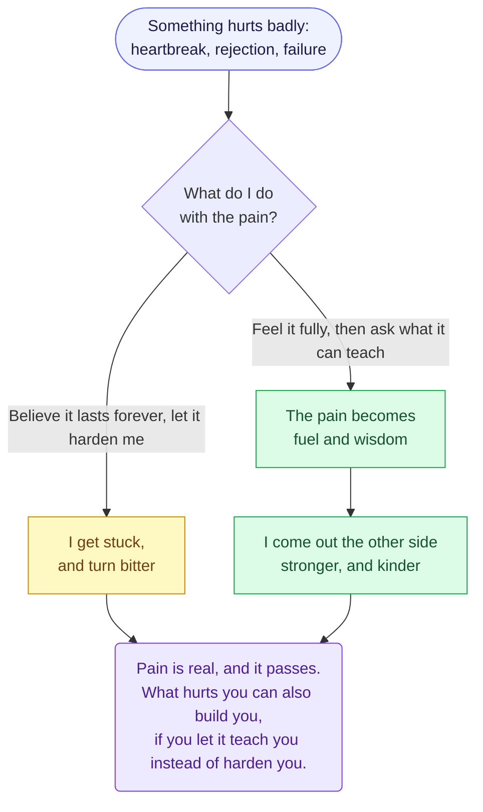
```mermaid
flowchart TD
  A(["Something hurts badly:<br/>heartbreak, rejection, failure"]) --> B{"What do I do<br/>with the pain?"}
  B -->|"Believe it lasts forever, let it harden me"| C["I get stuck,<br/>and turn bitter"]
  B -->|"Feel it fully, then ask what it can teach"| D["The pain becomes<br/>fuel and wisdom"]
  D --> E["I come out the other side<br/>stronger, and kinder"]
  C --> W("Pain is real, and it passes.<br/>What hurts you can also build you,<br/>if you let it teach you instead of harden you.")
  E --> W
  classDef start fill:#eef2ff,stroke:#6366f1,color:#1e1b4b;
  classDef good fill:#dcfce7,stroke:#16a34a,color:#14532d;
  classDef warn fill:#fef9c3,stroke:#ca8a04,color:#713f12;
  classDef wisdom fill:#ede9fe,stroke:#7c3aed,color:#4c1d95;
  class A start;
  class D,E good;
  class C warn;
  class W wisdom;
```

### 5.5 · The doors that don't close again
*Timing the biggest, hardest-to-undo choices — honestly, and without shame*

```mermaid
flowchart TD
  A(["Big feelings, and real choices<br/>about intimacy and the future"]) --> B{"Am I ready for<br/>where this could lead?"}
  B -->|"Act on impulse before I'm ready"| C["Becoming a parent very young, often<br/>before finishing study or finding my feet"]
  C --> D["A steeper road: interrupted study, tighter<br/>money, fewer options for a while"]
  B -->|"Wait until I'm truly ready, be responsible"| E["More time to grow up, learn, earn,<br/>and choose the right person first"]
  D --> W("Some doors, once opened, don't close,<br/>and becoming a parent is the biggest.<br/>No shame in any path, but waiting until you're ready<br/>stacks the odds in your favour. A tendency, not a verdict.")
  E --> W
  classDef start fill:#eef2ff,stroke:#6366f1,color:#1e1b4b;
  classDef good fill:#dcfce7,stroke:#16a34a,color:#14532d;
  classDef warn fill:#fef9c3,stroke:#ca8a04,color:#713f12;
  classDef wisdom fill:#ede9fe,stroke:#7c3aed,color:#4c1d95;
  class A start;
  class E good;
  class C,D warn;
  class W wisdom;
```

---

## Age 18–21 — Leaving home, finding direction

### 6.1 · Choosing what to study or do
*Curiosity over prestige — explore before you specialise (David Epstein)*

```mermaid
flowchart TD
  A(["I have to choose a path,<br/>and I'm honestly not sure"]) --> B{"How do<br/>I choose?"}
  B -->|"Chase whatever sounds most impressive"| C["I may end up good at something<br/>I don't actually care about"]
  B -->|"Follow real curiosity, build useful skills"| D["I find work that fits me,<br/>and skills transfer anywhere"]
  C --> W("It's fine not to know yet, some of the most<br/>interesting people didn't know at 22, or 42.<br/>Follow curiosity, build skills,<br/>and don't fear changing direction.")
  D --> W
  classDef start fill:#eef2ff,stroke:#6366f1,color:#1e1b4b;
  classDef good fill:#dcfce7,stroke:#16a34a,color:#14532d;
  classDef warn fill:#fef9c3,stroke:#ca8a04,color:#713f12;
  classDef wisdom fill:#ede9fe,stroke:#7c3aed,color:#4c1d95;
  class A start;
  class D good;
  class C warn;
  class W wisdom;
```

### 6.2 · Credit cards, loans, and "buy now, pay later"
*Not all debt is equal — the high-interest trap*

```mermaid
flowchart TD
  A(["Easy credit is everywhere:<br/>cards, BNPL, payday loans"]) --> B{"What kind of<br/>borrowing is this?"}
  B -->|"High-interest debt for wants"| C["Interest piles up, I pay far more,<br/>and it quietly traps me"]
  B -->|"Borrow only, carefully, to build value"| D["I stay free, and my money<br/>works for me, not the lender"]
  C --> N["Note: student loans differ, especially UK<br/>income-based ones. Judge each loan<br/>on its terms, not on the word 'debt'."]
  N --> W("High-interest debt for stuff you want<br/>is the trap that steals your future income.<br/>Compounding is glorious for you, and brutal against you.")
  D --> W
  classDef start fill:#eef2ff,stroke:#6366f1,color:#1e1b4b;
  classDef good fill:#dcfce7,stroke:#16a34a,color:#14532d;
  classDef warn fill:#fef9c3,stroke:#ca8a04,color:#713f12;
  classDef bad fill:#fee2e2,stroke:#dc2626,color:#7f1d1d;
  classDef note fill:#f1f5f9,stroke:#64748b,color:#0f172a;
  classDef wisdom fill:#ede9fe,stroke:#7c3aed,color:#4c1d95;
  class A start;
  class D good;
  class C bad;
  class N note;
  class W wisdom;
```

### 6.3 · Getting serious with someone
*The biggest life decision — character over chemistry (with real data)*

```mermaid
flowchart TD
  A(["I'm getting serious<br/>with someone"]) --> B{"What am I<br/>choosing on?"}
  B -->|"Mostly chemistry and excitement, rushing"| C["Choosing on sparks alone is risky,<br/>and rushing young raises the odds it ends"]
  B -->|"Character, kindness, shared values, no rush"| D["Far better odds of a<br/>partnership that lasts"]
  C --> S["Data: marrying in the teens or early 20s<br/>carries a much higher break-up risk.<br/>Risk is lowest in the late 20s to early 30s.<br/>A tendency, per Wolfinger, not a rule."]
  S --> W("Who you commit to shapes your whole life,<br/>more than almost any other choice.<br/>Chemistry fades, character compounds.<br/>Choose well, and don't rush it.")
  D --> W
  classDef start fill:#eef2ff,stroke:#6366f1,color:#1e1b4b;
  classDef good fill:#dcfce7,stroke:#16a34a,color:#14532d;
  classDef warn fill:#fef9c3,stroke:#ca8a04,color:#713f12;
  classDef note fill:#f1f5f9,stroke:#64748b,color:#0f172a;
  classDef wisdom fill:#ede9fe,stroke:#7c3aed,color:#4c1d95;
  class A start;
  class D good;
  class C warn;
  class S note;
  class W wisdom;
```

### 6.4 · When life feels unfair
*Owning your part — Epictetus, the dichotomy of control*

```mermaid
flowchart TD
  A(["Something went wrong,<br/>and life feels unfair"]) --> B{"Where do I<br/>put my focus?"}
  B -->|"Blame others, wait to be rescued"| C["I stay stuck<br/>and powerless"]
  B -->|"Sort what I control from what I don't"| D["Act on my part,<br/>accept the rest"]
  D --> E["I regain my power<br/>and move forward"]
  C --> W("Split the world into 'in my control'<br/>and 'not in my control'. Pour energy into the first,<br/>make peace with the second. This one idea is freedom.")
  E --> W
  classDef start fill:#eef2ff,stroke:#6366f1,color:#1e1b4b;
  classDef good fill:#dcfce7,stroke:#16a34a,color:#14532d;
  classDef warn fill:#fef9c3,stroke:#ca8a04,color:#713f12;
  classDef wisdom fill:#ede9fe,stroke:#7c3aed,color:#4c1d95;
  class A start;
  class D,E good;
  class C warn;
  class W wisdom;
```

---

## Age 22–25 — The early-adult levers

### 7.1 · Start investing now, or wait?
*Time is the most powerful ingredient in money — with the real numbers*

```mermaid
flowchart TD
  A(["Early 20s, with a<br/>little money to invest"]) --> B{"Start now,<br/>or wait until I earn more?"}
  B -->|"Wait until my 30s"| C["Pay 200 a month for 33 years,<br/>age 32 to 65: 79,200 paid in"]
  C --> CC["Grows to about<br/>309,000 by 65"]
  B -->|"Start now, even small"| D["Pay 200 a month for just 10 years,<br/>age 22 to 32: 24,000 paid in, then stop"]
  D --> DD["Left alone, grows to<br/>about 346,000 by 65"]
  CC --> P["The early starter paid in far LESS,<br/>24,000 vs 79,200, and ended with MORE,<br/>because the money had more time to grow"]
  DD --> P
  P --> W("Time beats size. Starting early beats starting big.<br/>Illustrative at about 7% a year, before fees, tax, and inflation.<br/>Real returns vary and nothing is guaranteed, but the lesson holds.")
  classDef start fill:#eef2ff,stroke:#6366f1,color:#1e1b4b;
  classDef good fill:#dcfce7,stroke:#16a34a,color:#14532d;
  classDef warn fill:#fef9c3,stroke:#ca8a04,color:#713f12;
  classDef note fill:#f1f5f9,stroke:#64748b,color:#0f172a;
  classDef wisdom fill:#ede9fe,stroke:#7c3aed,color:#4c1d95;
  class A start;
  class D,DD good;
  class C,CC warn;
  class P note;
  class W wisdom;
```

### 7.2 · Building a career
*Rare, valuable skills beat job titles — Cal Newport*

```mermaid
flowchart TD
  A(["I want work that pays well<br/>and feels meaningful"]) --> B{"What do I<br/>optimise for?"}
  B -->|"Titles, prestige, chasing pay alone"| C["Easily replaced,<br/>and pay plateaus"]
  B -->|"Rare, valuable, hard-to-replace skills"| D["I deliver real value<br/>and guard my reputation"]
  D --> E["Options, leverage, and pay<br/>follow the skills"]
  C --> W("Don't chase the title, build the skills<br/>that make the title come to you.<br/>Be so good they can't ignore you.")
  E --> W
  classDef start fill:#eef2ff,stroke:#6366f1,color:#1e1b4b;
  classDef good fill:#dcfce7,stroke:#16a34a,color:#14532d;
  classDef warn fill:#fef9c3,stroke:#ca8a04,color:#713f12;
  classDef wisdom fill:#ede9fe,stroke:#7c3aed,color:#4c1d95;
  class A start;
  class D,E good;
  class C warn;
  class W wisdom;
```

### 7.3 · The right way to worry
*Act where you can, release the rest — the Stoics and "Sunscreen"*

```mermaid
flowchart TD
  A(["I'm anxious<br/>about the future"]) --> B{"Is this worry<br/>doing anything?"}
  B -->|"Loop on worst cases I can't control"| C["I suffer twice, once imagining it,<br/>once if it ever happens, and act on nothing"]
  B -->|"Ask: can I act on this?"| D{"Can I act<br/>on it?"}
  D -->|"Yes"| E["Then act,<br/>now"]
  D -->|"No"| F["Then set<br/>it down"]
  C --> W("Worrying about what you can't control is paying<br/>interest on a debt you may never owe.<br/>The real troubles often aren't the ones you fear.")
  E --> W
  F --> W
  classDef start fill:#eef2ff,stroke:#6366f1,color:#1e1b4b;
  classDef good fill:#dcfce7,stroke:#16a34a,color:#14532d;
  classDef warn fill:#fef9c3,stroke:#ca8a04,color:#713f12;
  classDef wisdom fill:#ede9fe,stroke:#7c3aed,color:#4c1d95;
  class A start;
  class E,F good;
  class C warn;
  class W wisdom;
```

### 7.4 · "I feel invincible, is health a 'later' problem?"
*Health compounds like money*

```mermaid
flowchart TD
  A(["I'm young and feel invincible,<br/>is health a 'later' problem?"]) --> B{"How do I treat<br/>my body and mind now?"}
  B -->|"Trash sleep, never move, run on junk"| C["Fine for now, but<br/>the bill comes due, with interest"]
  B -->|"Protect sleep, move daily, tend my mind"| D["Energy, mood, and a future self<br/>who can still do what they love"]
  C --> W("Your body is the one place you're guaranteed<br/>to live for life. Health compounds like money:<br/>small daily deposits, repaid for decades. And yes, wear sunscreen.")
  D --> W
  classDef start fill:#eef2ff,stroke:#6366f1,color:#1e1b4b;
  classDef good fill:#dcfce7,stroke:#16a34a,color:#14532d;
  classDef warn fill:#fef9c3,stroke:#ca8a04,color:#713f12;
  classDef wisdom fill:#ede9fe,stroke:#7c3aed,color:#4c1d95;
  class A start;
  class D good;
  class C warn;
  class W wisdom;
```

---

## Any age — The timeless ones

### 8.1 · The master key
*The dichotomy of control — Epictetus*

```mermaid
flowchart TD
  A(["Something is<br/>bothering me"]) --> B{"Is it in<br/>my control?"}
  B -->|"In my control: my actions, effort, attitude, words"| C["Act on it,<br/>do my part fully"]
  B -->|"Not in my control: other people, outcomes, the past, luck"| D["Accept it, spend no<br/>energy fighting it"]
  C --> W("Almost all peace comes from this one sort:<br/>change what you can, accept what you can't,<br/>and learn to tell the difference.")
  D --> W
  classDef start fill:#eef2ff,stroke:#6366f1,color:#1e1b4b;
  classDef good fill:#dcfce7,stroke:#16a34a,color:#14532d;
  classDef wisdom fill:#ede9fe,stroke:#7c3aed,color:#4c1d95;
  class A start;
  class C,D good;
  class W wisdom;
```

### 8.2 · "I have time, don't I?"
*Memento mori — Seneca, On the Shortness of Life*

```mermaid
flowchart TD
  A(["I have time...<br/>don't I?"]) --> B{"How do I<br/>treat my time?"}
  B -->|"Autopilot, things that don't matter, 'I'll live later'"| C["The years slip<br/>by unnoticed"]
  B -->|"Remember it's finite, spend it on what matters"| D["I'm present, and give my hours<br/>to the people and work I love"]
  D --> E["A life that feels<br/>full, not just long"]
  C --> W("You don't have unlimited time,<br/>and you can't buy more. The point isn't to fear death,<br/>it's to stop wasting life. Spend your hours like the treasure they are.")
  E --> W
  classDef start fill:#eef2ff,stroke:#6366f1,color:#1e1b4b;
  classDef good fill:#dcfce7,stroke:#16a34a,color:#14532d;
  classDef warn fill:#fef9c3,stroke:#ca8a04,color:#713f12;
  classDef wisdom fill:#ede9fe,stroke:#7c3aed,color:#4c1d95;
  class A start;
  class D,E good;
  class C warn;
  class W wisdom;
```

### 8.3 · Life handed you something you didn't choose
*Amor fati — Nietzsche and the Stoics*

```mermaid
flowchart TD
  A(["Life gave me something<br/>I didn't choose or want"]) --> B{"How do I<br/>meet it?"}
  B -->|"Resent it, replay 'if only'"| C["I stay at war<br/>with what already is"]
  B -->|"Accept it, then ask how I can use it"| D["I work WITH reality,<br/>and often grow from it"]
  C --> W("Don't just bear what happens, learn to work with it,<br/>even to love it as part of your story.<br/>Fighting a reality you can't change only adds suffering.")
  D --> W
  classDef start fill:#eef2ff,stroke:#6366f1,color:#1e1b4b;
  classDef good fill:#dcfce7,stroke:#16a34a,color:#14532d;
  classDef warn fill:#fef9c3,stroke:#ca8a04,color:#713f12;
  classDef wisdom fill:#ede9fe,stroke:#7c3aed,color:#4c1d95;
  class A start;
  class D good;
  class C warn;
  class W wisdom;
```

### 8.4 · The universal filter: "Should I do this?"
*Three questions for any big, uncertain choice — including Bezos's regret-minimisation*

```mermaid
flowchart TD
  A(["Should I do this?<br/>A big, uncertain choice"]) --> B{"Does it fit my values and<br/>the person I want to be?"}
  B -->|"No"| X["Probably<br/>don't"]
  B -->|"Yes"| C{"If it goes wrong,<br/>can I recover from it?"}
  C -->|"Yes, it's reversible"| Y["Lower risk: try it<br/>and learn"]
  C -->|"No, it's hard to undo"| D{"At 80, would I regret<br/>NOT having tried?"}
  D -->|"Yes, I'd regret skipping it"| Z["Lean towards<br/>doing it"]
  D -->|"No, I'd be fine without it"| X
  Y --> W("Filter big choices through three questions:<br/>Does it fit who I want to be? Can I recover if it fails?<br/>Will I regret not trying when I'm old?")
  Z --> W
  X --> W
  classDef start fill:#eef2ff,stroke:#6366f1,color:#1e1b4b;
  classDef good fill:#dcfce7,stroke:#16a34a,color:#14532d;
  classDef warn fill:#fef9c3,stroke:#ca8a04,color:#713f12;
  classDef wisdom fill:#ede9fe,stroke:#7c3aed,color:#4c1d95;
  class A start;
  class Y,Z good;
  class X warn;
  class W wisdom;
```

---

## Sources, and a few honest caveats

A book like this should be honest about where it leans on evidence and where it leans on the accumulated experience of thoughtful people. Sanity-check anything before you print it — figures and findings drift over time.

**The thinkers behind the lessons**
- **Mary Schmich**, *"Advice, like youth, probably just wasted on the young"* (Chicago Tribune, 1 June 1997) — voiced to the world by **Baz Luhrmann** as *Everybody's Free (To Wear Sunscreen)* (1997/1999). The ideas about guarding hearts, not over-worrying about the future, your own timing for a family, and yes, sunscreen, are paraphrased from its spirit, not quoted.
- **The Stoics** — Epictetus (the dichotomy of control), Seneca (*On the Shortness of Life*; time as the one thing we can't buy back), Marcus Aurelius (*Meditations*), and the practice of *premeditatio malorum*, picturing the bad outcome in advance.
- **Friedrich Nietzsche** — *amor fati*, the love of one's fate, and the idea that suffering, met well, can build rather than break us.
- **Aristotle** — virtue and character as habits, and true friendship.
- **Carol Dweck** — the growth mindset, and the power of "yet".
- **Theodore Roosevelt** is widely credited with "comparison is the thief of joy" (attribution is debated, but the idea is sound).
- **Jeff Bezos** — the "regret-minimisation framework" behind the 80-year-old test.
- **Cal Newport** — "be so good they can't ignore you"; rare, valuable skills over titles.

**The statistics, and their limits**
- **Marriage timing (5.1, 6.3):** Nicholas Wolfinger's analysis of US survey data (and a parallel European analysis) finds divorce risk is far higher for those marrying in their teens or early 20s, falls sharply through the late 20s, is lowest in roughly the late 20s to early 30s, then ticks up modestly after the early 30s, the so-called "Goldilocks" pattern. This is **correlation, not destiny**: selection effects matter, and plenty of early and late marriages thrive. Treat it as a tendency.
- **Getting good at things (4.2):** Anders Ericsson's research shows *deliberate* practice, focused, effortful, feedback-driven, at the edge of your ability, is what builds expertise, not mere hours. The popular "10,000-hour rule" was a simplification Ericsson himself disliked. Later work (Macnamara and colleagues; David Epstein's *Range*) shows **talent, starting age, and broad exploration also matter** — practice explains a lot, but not everything.
- **Compound interest (7.1):** the figures are a clean illustration at about 7% annual growth, compounded monthly, before fees, tax, and inflation. The early investor (200/month for ages 22–32 = 24,000 in, then left to grow) reaches roughly 346,000 by 65; the later investor (200/month for ages 32–65 = 79,200 in) reaches roughly 309,000. Real returns vary year to year, and this is not a guarantee, but the *direction* — time beats size — is rock-solid maths.
- **Early parenthood (5.5):** that starting a family very young tends to correlate with interrupted education and tighter finances is well established, and it is **a tendency, not a verdict on anyone**. Framed here around readiness, not shame.

**A note on the whole thing.** Even the author of "Sunscreen" admitted her advice had no firmer basis than her own meandering experience. So will yours. These maps are a starting point, not a cage. Your child will redraw them, and that's exactly as it should be.
