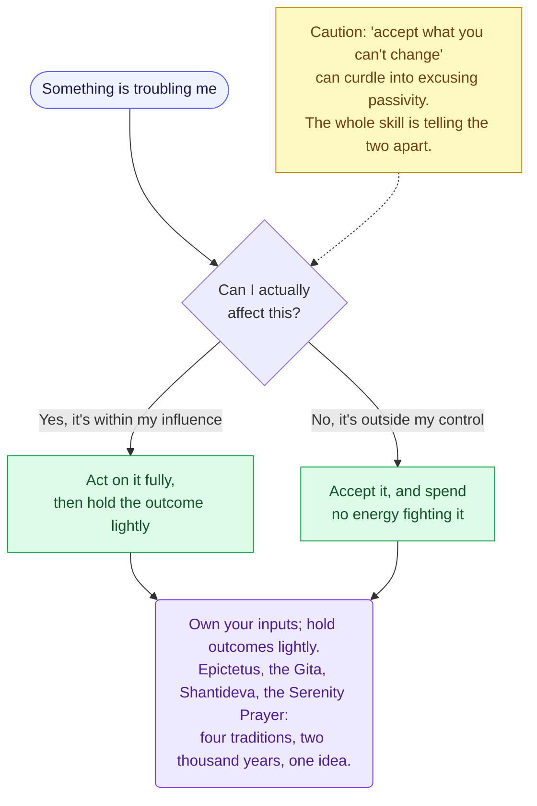

# The Map of a Life
## Architecture & Research Direction — v0.1

*A multi-format "wisdom through choices" project: an illustrated book, a living website, and a life-simulation game, all powered by one underlying graph of human wisdom.*

This document is the project's design spine. It answers nine questions: the refined vision, the research methodology, the ontology for the wisdom graph, the first-pass corpus of thinkers, the computational methods and their honest limits, how one graph powers three products, worked examples of a wisdom node, title directions, and the concrete next steps. It closes with the risks worth naming early and a starter corpus.

---

## 1 · The refined vision

**The thesis.** Wisdom is not a list of answers. It is a structure of recurring forks — choices made under tension, with consequences that ripple. The maxim "be frugal" is thin on its own; it becomes wisdom only in tension with "be generous," conditioned by *when*, *with whom*, and *at what cost*. So the natural representation of wisdom is not a quote wall but a **graph**: insights, the dilemmas they address, the virtues they cultivate, the dangers they guard against, the consequences they lead to, and — crucially — the places where they *contradict each other*.

**What makes this project distinct** from the ocean of quote books and "stoic wisdom" accounts:

1. **It is honest about contradiction.** Most wisdom content flattens the canon into agreeable platitudes. This project treats tensions as first-class objects. "Seize the day" and "remember you must die and plan the long game" are both wise; the project shows the fork and the conditions under which each applies, rather than pretending the great thinkers all agreed.
2. **It is evidence-informed without being pseudo-scientific.** When an idea recurs *independently* across traditions that never spoke to each other — Stoic Rome, Vedic India, Zen Japan — that convergence is a signal worth measuring, much as biologists treat convergent evolution as a signal of something real. We can quantify recurrence, map convergence, and flag contradiction, while being scrupulous that *recurrence is not proof*.
3. **It is beautiful and experiential.** The same wisdom is rendered three ways: as gorgeous printed diagrams, as a navigable living map, and as a life you actually play.

**The core architectural commitment** — and the keystone that makes the whole thing feasible — is **a single source of truth**. There is *one* wisdom graph. The book, the website, and the game are not three projects; they are three *projections* of the same graph. Build the graph once, well, and each product becomes a rendering problem rather than a fresh content problem.

---

## 2 · Research methodology — building the corpus

The goal is a corpus that is broad, well-sourced, honestly attributed, and structured enough to analyse. Five phases.

### Phase A — Sourcing (corpus construction)

Prefer **public-domain primary texts** as the bulk substrate (this also matters for a commercially published book — see §10). Candidate sources, all real and current:

- **Project Gutenberg** and **Internet Archive** — public-domain primary texts and older translations.
- **Perseus Digital Library** (Tufts) — Greek and Latin classics with scholarly apparatus.
- **Chinese Text Project (ctext.org)** — the Confucian, Daoist, and broader Chinese classical canon, with parallel translations.
- **SuttaCentral** and **Access to Insight** — the Buddhist canon across languages.
- **Sacred-Texts.com** — a broad (if uneven) cross-tradition religious and wisdom archive.
- **Stanford Encyclopedia of Philosophy** — not a text source but the gold standard for *scholarly framing*: use it to ground each thinker's actual position rather than the internet's cartoon of it.
- **Wikiquote** — useful for leads, but treated as *untrusted* until each quote is verified against a primary edition. The internet is saturated with misattribution (the prior phase of this project ran into exactly this: the "Sunscreen" essay was for years falsely credited to Kurt Vonnegut). Every Wikiquote-sourced unit starts at `attribution_confidence: dubious`.

Each text enters the corpus with provenance metadata: author, work, translator, edition, year, language, tradition, era, and a license/copyright flag.

### Phase B — Unitization

Break texts into **wisdom units** — the atomic objects of the graph. A unit is a single piece of advice, observation, argument, parable, or aphorism. Aphoristic works (La Rochefoucauld, Kenkō, the *Dhammapada*) are already pre-unitized, which is why they make ideal seed material. Longer argumentative works need extraction: an LLM proposes candidate units with citations, and a human verifies a calibrated sample.

Every unit is stored in two forms:
- the **original quotation** (with citation and translator), which preserves voice; and
- a **canonical claim** — a neutral one-sentence paraphrase ("Direct your energy to what is within your control"). The canonical form is what makes cross-text comparison possible, because two thinkers can say the same thing in wildly different words.

### Phase C — Annotation (coding)

Each unit is coded along the ontology dimensions in §3 (domain, life-stage, claim type, conditionality, polarity, the dilemmas it addresses, the virtues it cultivates). Use a **hybrid pipeline**: an LLM labels at scale, humans adjudicate a sample, and we **report inter-rater agreement** (e.g., Cohen's κ or Krippendorff's α between LLM and human coders). Publishing that agreement number is part of what separates "intellectually serious" from "vibes."

### Phase D — Computational structuring

Embed every canonical claim, cluster the semantic space, and construct the graph's edges (similarity, entailment, contradiction). Detailed in §5.

### Phase E — Robustness profiling

For each consolidated idea, compute a **multi-factor robustness profile** (not a single truth score). Factors and the honesty rules are in §5.

**Two methodological commitments run through all five phases:**

- **Computation proposes; humans dispose.** This mirrors the Six Degrees of Francis Bacon project, which combined statistically inferred relationships with human curation and labelled every edge by its origin. We do the same: machine-suggested clusters, contradictions, and convergences are *candidates* until a human confirms them, and the provenance of each edge (inferred vs. curated) is stored.
- **Provenance and reproducibility are features, not chores.** Version the corpus. Store every source. Make the methodology legible. This is the difference between a credible project and a horoscope.

---

## 3 · The ontology — a taxonomy for the wisdom graph

A property graph. **Nodes** are typed; **edges** are typed relations; **units** carry a rich attribute schema.

### Node types

| Node type | What it is | Example |
|---|---|---|
| **Insight** | An atomic claim, advice, or observation | "Own your effort; hold outcomes lightly" |
| **Dilemma** | A recurring fork / standing tension | "Seize the day ⟷ Play the long game" |
| **Virtue** | A trait worth cultivating | Courage, temperance, honesty, equanimity |
| **Danger** | A failure mode / vice | Hubris, resentment, comparison, akrasia |
| **Domain** | A life arena | Love, work, money, friendship, health, death |
| **LifeStage** | A season of life | Childhood, youth, parenthood, old age |
| **Practice** | An actionable technique | Negative visualization, journaling, fasting |
| **Consequence** | An outcome a choice leads to | Regret, trust, ruin, mastery |
| **Thinker** | A person | Marcus Aurelius, Zhuangzi, George Eliot |
| **Tradition** | A school or lineage | Stoicism, Madhyamaka Buddhism, the French moralists |
| **Work** | A specific text | *Meditations*, *Tao Te Ching*, *Middlemarch* |

### Edge (relation) types

- **Attribution layer:** `EXPRESSED_BY` (Insight→Thinker), `FROM_WORK` (Insight→Work), `IN_TRADITION` (Thinker/Work→Tradition), `INFLUENCED` (Thinker→Thinker — the intellectual-history layer).
- **Semantic layer:** `CONVERGES_WITH` (Insight↔Insight, independently agreeing across traditions — the strongest signal), `REFINES` / `QUALIFIES` (one insight conditions another), `CONTRADICTS` / `IN_TENSION_WITH` (signed, honest disagreement).
- **Functional layer:** `ADDRESSES` (Insight→Dilemma), `CULTIVATES` (Insight/Practice→Virtue), `GUARDS_AGAINST` (Insight→Danger), `LEADS_TO` (Choice→Consequence), `APPLIES_IN` (Insight→Domain/LifeStage).

### Unit attribute schema (the coding scheme)

```yaml
id: insight.control.dichotomy
type: Insight
canonical_claim: "Direct your energy to what is within your control; accept what is not."
register: principle            # aphorism | principle | argument | parable | metaphor | poem
claim_type: prudential         # empirical | normative | prudential | metaphysical | observational
polarity: prescriptive         # prescriptive | cautionary | descriptive
conditionality: high           # universal-ish | conditional | contested
life_domains: [adversity, anxiety, work, self]
life_stages: [youth, adult, elder]
attribution_confidence: verified   # verified | probable | dubious | apocryphal
robustness_profile: { ... }    # see §5
```

This single schema is what every product reads from. Note the deliberate choices: `claim_type` keeps us from confusing an *empirical* claim ("loneliness shortens life," which evidence can test) with a *prudential* one ("travel while you're young," which is advice, not fact) or a *metaphysical* one ("the self is an illusion," which is neither). And `conditionality` is doing heavy lifting — it is the field that lets the project say "this is usually wise, *but*."

---

## 4 · The first-pass corpus — thinkers, traditions, authors

Organised by lineage, with the *life-wisdom* angle noted. This is a research seed, not a syllabus; the analysis will tell us which voices earn the most space.

### Greco-Roman foundations
- **Pre-Socratics:** Heraclitus (flux; "character is fate"), Democritus (cheerfulness, *euthymia*).
- **Socrates / Plato** (the examined life), **Aristotle** (*Nicomachean Ethics* — the golden mean, *eudaimonia*, virtue as habit).
- **Stoics:** Marcus Aurelius (*Meditations*), Epictetus (*Enchiridion*), Seneca (*Letters*, *On the Shortness of Life*), Musonius Rufus.
- **Epicureans:** Epicurus (pleasure rightly understood, friendship), Lucretius (*De Rerum Natura*).
- **Cynics:** Diogenes, Antisthenes (radical self-sufficiency, contempt for vanity).
- **Skeptics:** Pyrrho, Sextus Empiricus (suspension of judgement, *ataraxia*).
- **Practical moralists:** Plutarch (*Moralia*), Cicero (*On Duties*, *On Old Age*), and the tragedians — Sophocles, Aeschylus, Euripides — plus Hesiod's *Works and Days* (the oldest "how to live" manual in the West).

### Nietzsche and his web (called out, per your brief)
Nietzsche is a hub node whose *edges* matter as much as he does.
- **Formative influences:** Schopenhauer (the will; pessimism — first an idol, then an antagonist), Heraclitus and the pre-Socratics (admired), Goethe (his ideal of the integrated human), **Emerson** (a deep and under-credited influence — self-reliance), Montaigne and the French moralists (the aphoristic form itself).
- **Admired across distance:** Dostoevsky (as a psychologist of the soul), Spinoza (kinship over *amor fati* and acceptance of necessity).
- **Antagonists / targets:** Socratic rationalism (ambivalent), Christianity and Paul, Kant, Rousseau, the English utilitarians (Mill), and Wagner (personal rupture). Mapping who Nietzsche *argued against* is how the graph captures that wisdom advances by collision, not consensus.

### Medieval → Enlightenment → modern (West)
- Boethius (*Consolation of Philosophy*), Augustine (*Confessions*), Thomas à Kempis (*Imitation of Christ*), Meister Eckhart.
- **Montaigne** (the great humane skeptic — possibly the single richest life-wisdom source in the canon), Machiavelli (unsentimental realism), Bacon (*Essays*), **Pascal** (*Pensées*), **La Rochefoucauld** (*Maxims* — aphorism as scalpel), Spinoza (*Ethics*).
- Hume, Adam Smith (*Theory of Moral Sentiments*), Kant, Rousseau, **Lichtenberg** (aphorisms), Goethe.
- **Kierkegaard** (choice, despair, the leap), Schopenhauer, Mill, **Thoreau** (*Walden*), **Emerson** (*Self-Reliance*), Tolstoy's *A Confession*, William James (habit, pragmatism, "the will to believe").
- 20th c.: **Camus** (the absurd; Sisyphus), Sartre and Beauvoir (freedom, bad faith), **Viktor Frankl** (*Man's Search for Meaning* — meaning through suffering; a living bridge to *amor fati*), Hannah Arendt, **Iris Murdoch** (attention, the Good), Bertrand Russell (*The Conquest of Happiness*), **Simone Weil** (attention, affliction).

### Eastern traditions
- **Chinese:** Confucius (*Analects*), Mencius, **Laozi** (*Tao Te Ching*), **Zhuangzi** (spontaneity, *wu wei*, the butterfly dream), Xunzi, Sun Tzu (*The Art of War* as strategy-for-living), the *I Ching*, Wang Yangming (the unity of knowing and doing).
- **Indian:** the **Bhagavad Gita** (action without attachment to its fruits — a striking convergence with Stoicism), the *Upanishads*, Patanjali's *Yoga Sutras*; **Buddhist:** the *Dhammapada*, the Buddha's core teaching (impermanence, attachment, the middle way), Nagarjuna, **Shantideva** (*Bodhicaryavatara*).
- **Japanese:** Zen (Dōgen's *Shōbōgenzō*; Hakuin), **Kenkō** (*Essays in Idleness / Tsurezuregusa* — a near-perfect aphoristic life text), **Kamo no Chōmei** (*Hōjōki* — impermanence), Musashi (*The Book of Five Rings*), Bashō (haiku as compressed insight), Yamamoto Tsunetomo (*Hagakure*), Okakura (*The Book of Tea* — *wabi-sabi*), Nishida Kitarō (Kyoto School). Key concepts as their own nodes: *mono no aware*, *wabi-sabi*, *ikigai*, *mottainai*.
- **Persian / Islamic:** **Rumi**, Hafiz, **Saadi** (*Gulistan* — practical ethics in verse), **Omar Khayyam** (*Rubaiyat* — carpe diem and impermanence), Al-Ghazali, Ibn Khaldun; and Khalil Gibran (*The Prophet*).

### Hebrew and wisdom literature
- **Ecclesiastes** (*Qoheleth* — vanity, impermanence, and "eat, drink, and find joy in your work"), Proverbs, the Book of Job (innocent suffering), **Pirkei Avot** (*Ethics of the Fathers*), the Psalms, the Sermon on the Mount.

### Literary authors — wisdom through story and metaphor
Story encodes wisdom that aphorism cannot: it shows *consequence over time*.
- **Tolstoy** (*Anna Karenina*; *The Death of Ivan Ilyich* — mortality), **Dostoevsky** (freedom, suffering, faith), **George Eliot** (*Middlemarch* — moral maturity, "the growing good of the world"), **Chekhov** (compassion for ordinary life), **Shakespeare** (the whole human weather — Hamlet on action and death, Lear on folly and age), Proust (time, memory).
- **Hermann Hesse** (*Siddhartha*), **Saint-Exupéry** (*The Little Prince* — "what is essential is invisible to the eye"), **Kazuo Ishiguro** (*The Remains of the Day* — the unlived life, dignity, regret), **Marilynne Robinson** (*Gilead* — grace and fatherhood; resonant with passing wisdom to a child), **Rilke** (*Letters to a Young Poet* — "live the questions"), **Mary Oliver** ("your one wild and precious life"), Borges, Baldwin, Maya Angelou.
- **Folk wisdom and proverbs** as a whole category: Aesop's fables, and cross-cultural proverb collections. Proverbs are crowd-sourced, time-tested wisdom — the closest thing the pre-modern world had to a robustness filter, and a goldmine for the cross-cultural convergence analysis.

A deliberate note: the digitized canon over-represents men, the West, the literate, and the recent translator. Women (Murdoch, Weil, Beauvoir, Eliot, Arendt, Robinson, Oliver), oral traditions, and Global-South voices must be **actively sourced**, not left to whatever Gutenberg happens to hold. This is both an ethical and a *validity* requirement (see §5).

---

## 5 · The data-science layer — and how to use it without overclaiming

### The methods

1. **Embeddings.** Encode every canonical claim with a sentence-embedding model (the sentence-transformers family). This places semantically similar claims near each other regardless of wording, era, or language.
2. **Clustering / topic modelling.** Run density-based clustering (HDBSCAN over a UMAP projection) or a topic model (e.g., BERTopic) to let themes *emerge from the data*. This is a check on the hand-built ontology in §3: where the machine's clusters and our categories disagree, one of them is wrong, and that's a useful conversation.
3. **Convergence detection.** High semantic similarity between claims from *independent* traditions flags a `CONVERGES_WITH` candidate. This is the project's most interesting signal — the idea that surfaces independently in Stoic Rome, Vedic India, and the Hebrew scriptures.
4. **Contradiction mapping.** Run a **Natural Language Inference** model over claim pairs (entailment / neutral / contradiction). Pairs flagged "contradiction" become candidate `IN_TENSION_WITH` edges. This is how the project finds its dilemmas *mechanically* rather than only by intuition.
5. **Frequency and recurrence — with independence weighting.** Naive counting is misleading: an idea repeated by twelve Stoics is *one tradition's* vote, not twelve. We weight recurrence by *independent origin*, so convergence across unrelated lineages counts for far more than repetition within one.
6. **Network analysis.** On the assembled graph: community detection (Leiden / Louvain) to find families of related wisdom; centrality measures to find the load-bearing ideas (which insights are connected to the most dilemmas and virtues); and **betweenness** to find *bridge* ideas that link Eastern and Western clusters — the connective tissue of the human conversation.

### The robustness profile (not a truth score)

Each consolidated idea gets a **profile**, presented as a small radar or a labelled set — never a single decimal pretending to precision:

- **Cross-tradition recurrence** — how many *independent* traditions express it.
- **Longevity** — the time span it covers.
- **Survives scrutiny** — has it been seriously challenged, and does the challenge refute it or merely *bound* it? (The best ideas get sharper under attack.)
- **Practical testability** — is it the kind of claim modern evidence can bear on at all?
- **Attribution integrity** — is it soundly sourced, or internet folklore?

Output vocabulary is deliberately hedged: an idea is **recurrent**, **cross-traditionally convergent**, **contested**, **conditional**, **empirically corroborated (with caveats)**, or **apocryphal** — *never* "scientifically proven."

### The honesty layer — the guardrails that keep this serious

This is the most important section in the document. The failure mode for a project like this is dressing up popularity as truth.

- **Recurrence is not truth.** That an idea is old and widespread means it *resonated* and was *useful enough to preserve* — not that it is correct. Slavery was a near-universal institution; ubiquity proved nothing. Recurrence is evidence of *psychological fit and independent discovery*, and we say exactly that.
- **Survivorship and selection bias.** We analyse what was written down, preserved, translated, and digitized — a filter that favours elites, the literate, the West, and recent translators. The corpus is a sample with known skew, and the project states the skew rather than hiding it.
- **Convergence across independent traditions is the strongest available signal** — analogous to convergent evolution — but it is a signal, not a proof, and we weight it by genuine independence.
- **Empirical evidence is *one input*, clearly labelled, and reported with its own caveats.** Two worked examples, both real:

  - *Corroboration.* Ancient wisdom about friendship and connection (Aristotle, Epicurus, Confucian relational ethics) is strikingly supported by the **Harvard Study of Adult Development** — an 80-year longitudinal study (Waldinger & Schulz, *The Good Life*, 2023) finding that satisfaction with relationships in midlife predicts late-life health better than cholesterol, IQ, social class, or genes; it also found that personality does *not* "set like plaster" by 30. We label this `empirically_corroborated`, while noting its limits: it is observational (not a controlled experiment, so causation is inferred), and the original cohorts were narrow (initially men; specific Boston and Harvard samples).

  - *Complication.* The popular "delayed gratification predicts success" maxim — the marshmallow test — is a cautionary tale. A larger, more diverse 2018 conceptual replication (Watts, Duncan & Quan) and a 2024 follow-up found the predictive power **shrinks dramatically once you control for the child's socioeconomic background and home environment**; much of the original "willpower" effect was a proxy for circumstance. We label the simple version `contested`. And then — this is the move that makes the graph valuable — we record the *deeper* insight the complication reveals: it is easier to wait when the world has been reliable to you. That is itself humane wisdom (security shapes character), and it becomes its own conditional node.

  Holding both examples — one where modern data confirms the ancients, one where it qualifies a modern cliché — is precisely what stops the project from looking like cherry-picking.

- **Computation proposes; humans verify**, and we report agreement metrics. No edge enters the published graph on a model's say-so alone.

---

## 6 · One graph, three products

The keystone again: **the book, the website, and the game are projections of a single versioned graph.** Store it once (a graph database such as Neo4j, or — for portability and simplicity — structured JSON / SQLite plus an embedding index). A small rendering layer turns graph data into each product's native form. For a spec-driven, agent-assisted workflow, this is ideal: define the schema once, generate everything downstream.

```
                 ┌─────────────────────────┐
                 │   THE WISDOM GRAPH       │
                 │  (single source of truth)│
                 │  nodes · edges · schema  │
                 │   + embedding index      │
                 └───────────┬─────────────┘
            ┌────────────────┼────────────────┐
            ▼                ▼                ▼
   ┌──────────────┐  ┌──────────────┐  ┌──────────────┐
   │   THE BOOK   │  │  THE WEBSITE │  │   THE GAME   │
   │ curated      │  │ the full     │  │ the graph    │
   │ traversal →  │  │ living graph │  │ made         │
   │ rendered     │  │ navigable by │  │ playable:    │
   │ diagrams     │  │ theme/thinker│  │ a life lived │
   │ (Mermaid/SVG)│  │ /dilemma/era │  │ as choices   │
   └──────────────┘  └──────────────┘  └──────────────┘
```

- **The book** is a *curated traversal*. Editors select the most robust and most beautiful nodes and the richest dilemmas, and lay them out as rendered decision trees, trade-off maps, and node constellations. It is finite, designed, and print-on-demand (Amazon KDP). Sources credited throughout; the methodology summarised in the foreword and given in full in an appendix. The book is "the greatest hits, and the map."
- **The website** is the *whole living graph*, navigable — filter and wander by theme, thinker, tradition, dilemma, consequence, or life stage; each node is a card showing the claim, the voices that converge and dissent, the tensions, the practice, and the sources. Free, and the canonical home; the book and game are downstream of it.
- **The game** is the graph made *experiential*. You live an ordinary life — childhood, family, friendship, ambition, love, work, money, failure, illness, ageing — and each fork in the story *is* a dilemma node from the graph. Choices traverse edges; consequences are modelled by the relations (a choice that `CULTIVATES` courage but `GUARDS_AGAINST` nothing may also `LEADS_TO` recklessness; choosing security over freedom at 22 opens some branches and closes others). State variables — relationships, character, inner life, resources — accumulate from what you chose. The design principle inherited from this project's first phase scales up here: **show consequences, never moralise.** The game must let you choose badly and live the result, not lecture you.

  The most beautiful tie-in: at the end of a playthrough, the game draws **the map of the life you lived** — literally your path through the wisdom graph, the forks you took, the roads you didn't, the wisdom you embodied without naming. The game's ending *is* a personalised edition of the book.

One graph. Build it once; it pays out three times.

---

## 7 · What a wisdom node looks like

### 7a · An Insight node (fully specified)

```yaml
id: insight.control.dichotomy
type: Insight
canonical_claim: "Direct your energy to what is within your control; accept what is not."
register: principle
claim_type: prudential
polarity: prescriptive
conditionality: high
life_domains: [adversity, anxiety, work, relationships, self]
life_stages: [youth, adult, elder]
addresses_dilemma: [dilemma.agency_vs_acceptance]
cultivates: [virtue.equanimity, virtue.resilience]
guards_against: [danger.futile_worry, danger.resentment]

voices:                              # independent expressions across traditions
  - thinker: Epictetus
    tradition: Stoicism
    work: "Enchiridion, ch. 1"
    era: "~125 CE"
    gloss: "Some things are within our power; others are not."
    attribution_confidence: verified
  - thinker: Bhagavad Gita
    tradition: Vedanta
    work: "Bhagavad Gita 2.47"
    era: "~200 BCE"
    gloss: "You have a right to your actions, but never to the fruits of your actions."
    attribution_confidence: verified
  - thinker: Shantideva
    tradition: Mahayana Buddhism
    work: "Bodhicaryavatara"
    era: "~700 CE"
    gloss: "If the problem can be solved, why worry? If it cannot, worrying will do no good."
    attribution_confidence: verified
  - thinker: Reinhold Niebuhr (attributed)
    tradition: Christian / modern
    work: "the Serenity Prayer"
    era: "~1930s"
    gloss: "Serenity to accept what I cannot change, courage to change what I can, wisdom to know the difference."
    attribution_confidence: probable     # popularised via AA; exact origin debated

convergence:
  independent_traditions: 4
  spans: "~2,000 years"
  note: "Arises in cultures with little or no contact — a strong convergence signal."

tensions:                            # honest disagreement, not hidden
  - against: insight.radical_ownership      # "take full responsibility for outcomes"
    nature: scope_dispute
    note: "Achievement culture says own the outcome; Stoicism says own only the effort. The honest synthesis: own your inputs fully, hold outcomes lightly."
  - against: danger.quietism
    nature: failure_mode
    note: "Pushed too far, 'accept what you can't change' excuses passivity toward injustice you could in fact affect. The dividing line — can I really affect this? — is the hard part, not a footnote."

conditionality_note: "Most useful for what is genuinely outside your influence; misapplied when used to dodge what you could change."

empirical_touchpoints:
  - field: clinical psychology
    note: "Resonant with CBT and Acceptance & Commitment Therapy, where distinguishing the controllable from the uncontrollable is a core move. Supportive context, not proof of the principle."
    confidence: moderate

robustness_profile:
  cross_tradition_recurrence: high
  longevity: high
  survives_scrutiny: high            # the quietism critique sharpens rather than refutes it
  practical_testability: moderate
  attribution_integrity: high
  label: "Recurrent · cross-traditionally convergent · conditional at the margins"
```

The same node, rendered as a **book diagram** straight from that data — demonstrating the data-to-diagram pipeline:



### 7b · A Dilemma node (how contradiction is represented honestly)

```yaml
id: dilemma.seize_vs_save
type: Dilemma
name: "Seize the day  ⟷  Play the long game"
question: "Act on this desire now, or defer it for a longer-term good?"
appears_in: [life_stage.youth, life_stage.midlife]
status: enduring_tension             # not a problem to be solved, a fork to be navigated

poles:
  - id: pole.carpe_diem
    stance: "Live now; the future is promised to no one."
    voices:
      - { thinker: Horace, gloss: "Pluck the day.", work: "Odes I.11" }
      - { thinker: Omar Khayyam, gloss: "The bird of time is on the wing.", work: "Rubaiyat" }
      - { thinker: Ecclesiastes, gloss: "Eat, drink, and find joy in your work.", work: "Ecclesiastes" }
      - { thinker: Mary Oliver, gloss: "Your one wild and precious life.", attribution_confidence: verified }
  - id: pole.long_game
    stance: "Remember death, and build what lasts; deferral compounds."
    voices:
      - { thinker: Seneca, gloss: "Life is long enough if you spend it well.", work: "On the Shortness of Life" }
      - { thinker: Aesop, gloss: "The ant and the grasshopper.", work: "Fables" }
      - { thinker: "(arithmetic)", gloss: "Compound interest rewards the patient.", attribution_confidence: verified }

resolution_pattern: >
  There is no winner. The wisdom is in the *match*: seize what cannot be deferred
  (presence, love, wonder, this particular day with this particular person) and bank
  what genuinely compounds (health, skill, money, trust). The classic error is doing it
  backwards — deferring presence while squandering the things that compound.

robustness_profile:
  label: "An enduring, unresolved tension — both poles are wise; the skill is conditional matching"
```

A dilemma node has *no* single answer by design. That is the whole point — and it is what no quote book does.

---

## 8 · Title directions

Your shortlist is strong; *The Map of a Life* and *The Shape of a Life* are the most evocative, and *To Live Is to Choose* is a genuinely good aphorism. *A Life Well Lived* is a touch overused. A useful pattern for a published book is a **poetic main title plus a descriptive subtitle** — the first sells the feeling, the second wins the Amazon search.

**Literary / poetic**
- **The Map of a Life** *(your idea — and, on reflection, the strongest; it is already the working title of this document)*
- An Atlas of the Examined Life
- Every Road You Didn't Take
- Ten Thousand Forks *(a quiet nod to the Daoist "ten thousand things")*
- Where the Roads Divide
- The Shape of a Life

**Serious / credible**
- On Choosing
- The Architecture of a Life
- Wisdom at the Crossroads
- The Decisions That Make a Life

**Accessible / commercial**
- Forks in the Road
- The Choices That Make Us
- Which Way to Live
- A Life in Choices

**Evocative / game-leaning**
- Mortal
- The Long Way *(note: this clashes with your children's-project finalist "Take the Long Way" — probably keep them apart)*

**Recommended direction.** Lead with **The Map of a Life**, paired with a descriptive subtitle, e.g.:
> ***The Map of a Life** — the choices, tensions, and gathered wisdom of being human, drawn as decision trees.*

A strong serious-credible alternative is *An Atlas of the Examined Life*. **Caveat:** run a trademark and existing-title check before committing — "The Examined Life" is the title of a Robert Nozick book, and evocative phrases are often taken. The pattern survives even if a specific phrase doesn't.

---

## 9 · Next concrete research steps

A sequence designed to ship value early and de-risk the big claims.

1. **Freeze the ontology v0.1** as a machine-readable schema (the §3 YAML, formalised). This is the single source of truth; everything else reads from it.
2. **Assemble a seed corpus** of 10–12 anchor texts that are public-domain *and* aphorism-dense (see the appendix). Aphoristic + public-domain = the fastest route to a high-quality starter graph with no licensing friction.
3. **Pilot the unitize-and-code pipeline** on two contrasting texts (say, Epictetus's *Enchiridion* and the *Tao Te Ching*). Measure LLM-versus-human coding agreement; refine the schema where it breaks.
4. **Run the first embedding + clustering pass** over the pilot units. Compare the machine's emergent themes against the hand-built taxonomy and reconcile the differences.
5. **Hand-build the first 30–50 keystone nodes** — the most robust, recurrent, beautiful ideas, each with full provenance, tensions, and a robustness profile. This set *is* Book Volume I content *and* the website seed, so the effort is never wasted.
6. **Prove the rendering pipeline** end to end on one node: schema → Mermaid/SVG (book view) and schema → a web card (site view). This validates the "one graph, three products" keystone before scaling.
7. **Spec the game's state model** and map ten life-stage dilemmas to graph nodes for a vertical-slice prototype.
8. **Lock the tooling choices:** graph store (Neo4j vs. SQLite + JSON), embedding model, web visualization stack, and the book renderer.
9. **Stand up the honesty layer:** the attribution-verification workflow (the apocryphal-quote filter) and the robustness-profile rubric, written down so they're applied consistently.

---

## 10 · Risks and open questions (worth naming now)

- **"Recurrence ≠ truth" is the central intellectual risk.** Mitigated by the hedged output vocabulary, the dilemma/conditionality model, and refusing the language of proof. If the project ever says "science proves the ancients right," it has failed.
- **Corpus bias.** The digitized canon skews Western, male, literate, and recent-translation. Counter by *actively* sourcing women, Eastern, oral, and Global-South voices, and by stating the skew openly.
- **Misattribution.** The internet-quote problem (the Vonnegut/"Sunscreen" affair, writ large across thousands of fake quotes). The `attribution_confidence` field plus a verification workflow is the defence; many beloved quotes will turn out to be apocryphal, and saying so is part of the project's integrity.
- **Translation distortion.** An aphorism can shift meaning across translators. Prefer multiple translations for keystone passages; record the translator on every unit.
- **Copyright (matters commercially).** Build the bulk graph from public-domain primary texts and pre-1929 translations. Treat modern translations and 20th–21st-century literary works as *cited and paraphrased* references, with short quotations only — the same discipline used in this project's first phase. This keeps the book cleanly publishable.
- **Scope and feasibility.** The full vision is enormous. The seed-corpus-then-keystone-nodes path keeps it tractable and produces a shippable book and website from the very first 30–50 nodes, with the graph growing from there.
- **The game's preachiness risk.** A wisdom game that lectures is dead on arrival. The design must let players choose badly and live the consequences; the wisdom should be *felt* in outcomes, never narrated as a lesson.

---

## Appendix · Seed corpus — anchor texts for the first pass

Public-domain and aphorism-dense, chosen for cross-tradition spread:

- **Stoic:** *Meditations* (Marcus Aurelius); *Enchiridion* & *Discourses* (Epictetus); *Letters to Lucilius* & *On the Shortness of Life* (Seneca)
- **Chinese:** *Tao Te Ching* (Laozi); *Zhuangzi*; *Analects* (Confucius)
- **Indian / Buddhist:** *Dhammapada*; *Bhagavad Gita*; *Bodhicaryavatara* (Shantideva)
- **Japanese:** *Essays in Idleness* (Kenkō); *Hōjōki* (Kamo no Chōmei); *Hagakure* (Yamamoto Tsunetomo)
- **Hebrew wisdom:** *Ecclesiastes*; *Proverbs*; *Pirkei Avot*
- **European moralists:** *Essays* (Montaigne); *Maxims* (La Rochefoucauld); *Pensées* (Pascal); *Aphorisms* (Lichtenberg)
- **Persian:** *Gulistan* (Saadi); *Rubaiyat* (Omar Khayyam)
- **American transcendental:** *Walden* (Thoreau); *Self-Reliance* (Emerson)
- **On living the questions:** *Letters to a Young Poet* (Rilke)
- **Fable / proverb:** *Aesop's Fables*; cross-cultural proverb collections
- **The hub:** Nietzsche's aphoristic works (*Beyond Good and Evil*, *Twilight of the Idols*, *The Gay Science*) — use public-domain translations, or paraphrase

These alone span roughly 2,500 years and at least eight independent traditions — enough to make the convergence and contradiction analysis meaningful from the very first pass.
